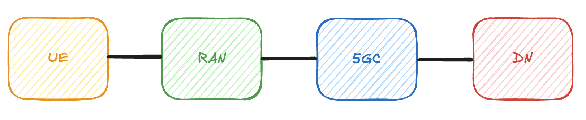
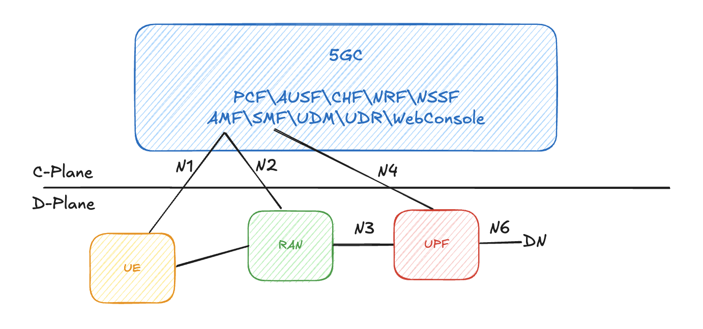

# 第 2 章：5G 核心網 3GPP 角度總覽

在第一章裡，我們從「為什麼需要核心網路」與「4G EPC 的演進與限制」開始談起。
從這一章開始，我們會用 **3GPP 的視角**，來看整個 5G 系統（5GS）的設計：
標準怎麼訂、系統大致長什麼樣子、5G 裡常被提到的 SBA、接口（N1/N2/N3…）到底是什麼意思。

> [!Important]
> 本章的目標不是讓你背下所有編號，而是先建立一個**空間感**：  
>
> 知道「5G 系統大致長怎樣」、「控制面跟使用者面怎麼分」，詳細的關鍵概念包含各個 NF 的實際作用之後還會再細講。

## 2.1 3GPP 與 5G 系統標準化概述

要理解 5G 核心網，第一步其實是搞懂：**誰在訂規格？規格長什麼樣子？**

### 2.1.1 3GPP 是什麼？

3GPP（3rd Generation Partnership Project）是一個國際性標準組織，負責制定 3G、4G、5G 相關的技術標準。
它不是一家公司，而是一個「合作平台」，成員包含設備商、營運商、晶片商、研究單位等。

在 3GPP 裡，大致可以分成三大方向的工作組：

- **SA（Service & System Aspects）**

    負責「整體架構」與「服務需求」的設計。
    例如：5G 系統（5GS）的整體架構、網路功能怎麼切分、有哪些接口、支援哪些服務類型等，都是在 SA 這邊討論。

- **RAN（Radio Access Network）**

    專注在「無線接取技術」，也就是 NR（New Radio）的協定、訊號設計、空口相關規格。
    常聽到的 38.xxx 系列（例如 38.300、38.331），就是規定 RAN 的規格書。

- **CT（Core Network & Terminals）**

    負責「核心網與終端相關的協定與訊令」。
    例如 UE 如何跟核心網交握、NAS/NGAP 訊令長什麼樣子，還有各種呼叫流程的細節，都在 CT 裡被定義。

> [!Tip]
> 可以簡單這樣記：
>
> - SA：決定 5G 長什麼樣子（架構與服務）
> - RAN：決定無線怎麼傳
> - CT：決定訊令怎麼走、流程怎麼跑

### 2.1.2 23.501 / 23.502 / 23.503 的角色

在 5G 核心網相關的文件裡，最常被提到的三個 TS（Technical Specification）是：

- **TS 23.501 - 系統架構（System Architecture）**

    這份文件主要在定義「5G 系統整體架構」，包括：

    - 有哪些網路功能（NF），例如 AMF、SMF、UPF 等
    - 它們之間有哪些接口（N1、N2、N3、N4、N6、Nn…）
    - 不同服務場景（eMBB/URLLC/mMTC）在架構上的支援方式

    可以把 23.501 想成「5G 的建築藍圖」。

- **TS 23.502 - 程序與流程（Procedures）**

    專門描述「事情發生時，系統怎麼運作」，例如：

    - UE 如何註冊（Registration）  
    - 如何建立與釋放 PDU Session  
    - Handover 大致怎麼進行

> [!Tip]
> 可以簡單這樣記：
>
> - 23.501 是「5GSA 的建築藍圖」。
> - 23.502 是「在這棟建築裡，大家遇到各種情境時的作業手冊」

### 2.1.3 38.x 系列與 RAN 信令

剛剛提到的都是核心網路比較相關的文件，而在 5G 無線接取（RAN）這一側，你會常看到 **38.xxx** 開頭的文件：

- 例如 **TS 38.300**：描述 NR 與 NG-RAN 的整體架構
- **TS 38.331**：定義 RRC（Radio Resource Control）協定，也就是 UE 和 gNB 之間的控制訊令
- 還有一系列 38.3xx/38.4xx 文件，描述實體層、MAC、RLC、PDCP 等細節

這些文件主要關心的是「UE ↔ gNB（基地台）」之間怎麼互動，而本書聚焦在 **核心網（5GC）**，所以只會在必要的地方簡單帶過 RAN 訊令，幫助你建立前後關聯。

### 2.1.4 5GC + NR = 5GS

在 3GPP 的定義裡，「5G 系統（5GS）」包含兩個主要部分：

- **5GC（5G Core）**：也就是本書主要要介紹的核心網  
- **NR（New Radio）/ NG-RAN**：新的無線接取網路（gNB 等）

兩者加起來，才構成一個完整的 5G 系統。  
所以你可以把 5GS 理解為：「**5GC + NR 所組成的整體網路**」。

## 2.2 5G 系統總覽（5GS Overview）

在深入細節之前，我們先用一個簡單的角度來看整個 5G 系統大致長什麼樣子。

### 2.2.1 UE – RAN – 5GC – DN：從手機到服務的路徑

從使用者的角度來看，一支手機（UE）要用網路，大致會經過這幾層：

- **UE（User Equipment）**：手機、CPE、IoT 裝置等  
- **RAN（無線接取網，這裡是 gNB / NG-RAN）**：負責把無線訊號轉成封包，並接到核心網  
- **5GC（5G Core）**：處理註冊、身分、路由、政策、計費等邏輯  
- **DN（Data Network）**：資料網路，可能是 Internet、企業專網、公有雲 VPC、IMS 網路等

### 2.2.2 RAN 與 Core 的分工

- **RAN 比較像「接入站」**

    - 管理無線電資源：誰可以傳、傳多少、用什麼調變
    - 負責把每支 UE 的數據，包裝好送往核心網

- **Core 比較像「指揮中心 + 交通分流站」**

    - 決定 UE 是誰、能不能上網、該走哪條路
    - 決定這些封包要送到哪一個 DN、要套什麼 QoS 和政策

這種分工方式，跟 4G 時代很像，但在 5G 裡會更清楚地把控制面與使用者面分開，方便做優化與彈性部署。

## 2.3 SBA（Service-Based Architecture）

在 4G EPC 裡，很多網元之間是透過 **Diameter** 或其他傳統電信協定來溝通。
到了 5G 核心網，3GPP 做了一個很大的改變：**改用 HTTP + JSON 風格的 Service-Based Architecture（SBA）**。

### 2.3.1 為什麼捨棄 Diameter，改用 HTTP + JSON？

主要有幾個原因：

- 希望讓電信網路更接近一般 IT / Cloud 的技術棧，方便導入現有工具與生態系
- 讓網元之間的互動更像「微服務」：每個網元提供一組清楚定義的 API  
- 相比 Diameter，HTTP 在多路複用、延遲與部署靈活性上較有優勢

對開發者與研究者來說，這也代表你可以用比較熟悉的 Web 技術來理解與實作部分 5GC 邏輯。

### 2.3.2 什麼是 Service-Based Interface（SBI）？

在 SBA 中，網路功能（NF）對外提供「Service」，例如：

- AMF 提供與 UE 註冊相關的服務
- SMF 提供與 PDU Session 管理相關的服務
- PCF 提供策略與控制相關的服務

這些服務透過一個統一的概念介面—— **SBI（Service-Based Interface）** ——來互通，實際上就是一組 HTTP + JSON 的 API。

> [!Tip]
> 可以把 SBA 想像成：「5GC 裡每個網元都是一個 Service Provider，彼此透過 REST 風格的 API 來叫對方」。

### 2.3.3 SBA 的優勢

相較於傳統網元對網元的固定介面，SBA 帶來了幾個明顯的優點：

- **可擴展**：某個 NF 壓力太大時，可以開更多實例，只要都在 NRF 註冊，就能被動態使用。
- **可替換**：同一種 NF，可以有不同廠商或不同版本並存，透過 API 介面來做兼容。
- **可互通**：只要遵守同樣的 API 規格，不同實作之間就有機會互通，降低廠商綁定。
- **易測試**：開發與測試人員可以針對單一 NF 或單一 API 進行測試，而不一定要把整個系統都拉起來。

## 2.4 5G 接口與協定分類（N1 / N2 / N3 / N4 / N6 / SBA）

這一節是本章最核心的部分之一，我們會用「控制面 vs 使用者面」來整理 5G 裡常見的接口名稱。

### 2.4.1 控制面接口

控制面主要負責「交談與協調」，不是實際承載大量資料。常見的接口有：

- **N1：UE ↔ 5GC（NAS）**

    - UE 與 5GC 之間的高層控制訊令，例如 Registration、PDU Session 建立請求等。
    - 訊令內容稱為 **NAS（Non-Access Stratum）**，實際是透過 RAN 轉送到 AMF。

- **N2：RAN ↔ 5GC（NGAP）**

    - gNB 與 5GC（AMF）之間的控制介面。
    - 使用的協定是 **NGAP**，負責像是 UE Context 設定、Handover 控制、PDU Session 相關控制訊息等。

- **N4：SMF ↔ UPF（PFCP）**

    - SMF 透過 N4 指示 UPF 如何建立或更新轉送規則（例如封包該往哪一個 DN、用什麼 QoS）。

- **Nn：5GC NF ↔ NF（SBA / HTTP/2）**

    - 這是一個統稱，用來表示 5GC 內部各個網路功能（NF）之間的 Service-Based 互動。  
    - 實際上使用 HTTP/2 + JSON（即我們前面提到的 SBI），例如 AMF 與 SMF、SMF 與 PCF 等的互動。

### 2.4.2 使用者面接口

使用者面則是「真正載著你看影片、開網頁、傳資料的封包」的路徑：

- **N3：RAN ↔ UPF（GTP-U）**

    - gNB 與 UPF 之間的使用者面通道。  
    - 使用 GTP-U 協定來封裝 UE 的 IP 封包，類似於 4G 裡的 S1-U。

- **N6：UPF ↔ DN（Data Network）**

    - UPF 與外部資料網路（例如 Internet、企業專網）之間的連接。

## 2.5 5G 核心流程概述

這一節只用「概念層面」來介紹幾個 5G 裡最重要的流程：不深入每個網元的細部行為，而是幫你先看到整體故事線。

### 2.5.1 Registration 程序（NAS / NGAP）

Registration 可以視為 5G 裡的「註冊 / 登入程序」，大致上包含這幾個關鍵步驟：

1. **UE 發起 Registration Request**：UE 開機或進入 5G 網路時，透過 RAN 把 NAS 註冊請求送到 AMF。
2. **建立 UE Context**：AMF 收到請求後，會為這個 UE 建立一份「上下文（Context）」，裡面包含身分、位置、能力等資訊。
3. **安全相關程序**：包含身分驗證（Authentication）、安全模式設定（Security Mode），確保後續訊令與資料都是在加密與受保護的狀態下進行。
4. **Registration Complete**：當雙方完成必要的交換與設定後，UE 會回覆 Registration Complete，表示它已經正式「登入」到 5G 網路。

> [!Tip]
> **註冊**的程序就是 UE 開機或是關閉飛行模式時，對核心網路發起的第一個**進入**程序。

### 2.5.2 PDU Session 程序

在 4G 裡，我們常講 **Bearer**；在 5G 裡，對應的核心概念是 **PDU Session**，你可以把 PDU Session 想成：「UE 與某個資料網路（DN）之間的一條**邏輯連線**」。

流程大致如下：

1. **UE 請求建立 PDU Session**：當 UE 想要上網或連到某個服務時，會發送 PDU Session Establishment Request。
2. **SM 控制平面建立對應的邏輯**：核心網裡的 SMF 會決定這個 PDU Session 要連到哪一個 UPF、哪一個 DN 以及要給什麼樣的 QoS 設定
3. **UP 建立 GTP-U 路徑**：透過 N3（RAN ↔ UPF）與 N6（UPF ↔ DN），實際構成這條 Session 的使用者面路徑。

之後 UE 的資料封包，就會沿著這條 PDU Session 被轉送，而一個 UE 同時可以有多個 PDU Session，分別對應不同的服務或網路。

> [!Tip]
> PDU session 的建立就是為了建立一條從 UE 到 DN 的邏輯連線！

### 2.5.3 Handover 概念

Handover（切換）指的是 UE 在移動過程中，從一個基地台切換到另外一個基地台，但連線不中斷的過程。

這裡只要理解兩件事：

- **控制面的遷移**：系統需要更新 UE 的位置資訊，讓核心網知道 UE 現在是透過哪一個 RAN 連進來的。

- **使用者面路徑的切換**：為了讓封包繼續順利抵達 UE，需要把原本通往舊 gNB 的路徑，改成通往新 gNB，在某些情況下，UPF 的路徑也可能需要調整。

## 2.6 QoS Flow 與 5QI：5G 與 4G QoS 模型差異

QoS（Quality of Service）是行動網路裡的一個重要主題，在 4G 裡，我們常講「Bearer」；到了 5G，**QoS Flow** 變成了更核心的概念。

### 2.6.1 4G Bearer vs 5G QoS Flow

- 在 **4G** 裡，一個 EPS Bearer 通常對應一組 QoS 設定，UE 與核心網會為特定服務建立或調整 Bearer。
- 在 **5G** 裡，PDU Session 是一條「主隧道」，**底下可以掛多個 QoS Flow**，每個 Flow 有自己的 QoS 特性。

> [!Note]
> 這代表什麼？
>
> 同一條 PDU Session 裡，不同種類的流量，可以走不同的 QoS Flow，例如：
>
> - 同一支手機，一條 PDU Session 同時承載一般上網與即時語音
> - 網路可以為語音流量給較高優先權、較低延遲，而一般上網則採用較寬鬆的設定

### 2.6.2 Flow-level QoS：QFI、5QI、GBR / Non-GBR、MBR

在 5G 裡，每一個 QoS Flow 會有一些關鍵屬性（本書後面會再細拆），這裡先點出幾個名詞：

- **QFI（QoS Flow Identifier）**：用來識別一個 QoS Flow 的 ID。
- **5QI（5G QoS Identifier）**：定義這個 Flow 使用什麼樣的 QoS 模板。

    - 延遲要求
    - 優先權等級
    - 丟包容忍度

- **GBR / Non-GBR**：

    - GBR（Guaranteed Bit Rate）：保證一定頻寬
    - Non-GBR：不保證頻寬，多數一般資料服務屬於此類

- **MBR（Maximum Bit Rate）**：

    - 顧名思義是「最大頻寬上限」，常搭配 GBR 一起出現
    - 可以簡單理解為：**GBR 是「至少要給到這麼多」，MBR 是「最多只能到這麼多」**
    - 系統透過 MBR，避免某個 Flow 在網路資源很充足時「吃到太肥」，影響到其他使用者或其他服務

透過這樣的設計，5G 可以更彈性地支援 eMBB、URLLC、mMTC 等不同場景，在同一條 PDU Session 裡，對不同類型的流量給予不同級別的待遇。

## 2.7 5G 安全概論

安全是 5G 設計中的重要一環，但本書不會在這一章深入加密演算法或數學細節，而是先用幾個關鍵詞，建立你對 5G 安全機制的基本印象。

### 2.7.1 5G AKA（Authentication and Key Agreement）

5G 繼承並延伸了以往世代的 AKA 架構：

- 透過 UE 與網路之間的挑戰與回應，確認雙方身分  
- 同時協商出後續用來保護訊令與資料的金鑰

你可以把它想像成「雙方先互相確認我真的是我、你真的是你，然後一起決定要用什麼鑰匙鎖門」。

### 2.7.2 SUCI / SUPI：隱私保護

在 5G 裡，為了更好地保護用戶隱私，引入了：

- **SUPI（Subscription Permanent Identifier）**：類似「真實身分」（例如對應到 IMSI）。

- **SUCI（Subscription Concealed Identifier）**：是經過加密保護後的身分標識，用於空口傳輸，這樣一來，即使有人在無線介面上偷聽，也不容易直接看出用戶的真實身分。

## 2.8 本章總結：3GPP 視角下的 5GC

在本章中，我們從 3GPP 的角度，對 5G 系統與核心網做了一次「高空俯瞰」：

- 理解了 **3GPP 的角色**，以及 SA / RAN / CT 在 5G 標準化中的分工
- 了解了 **23.501 / 23.502 / 23.503** 在架構、程序與政策上的定位
- 看到了 **5GS = 5GC + NR** 的整體結構，以及 UE – RAN – 5GC – DN 的大致關係
- 建立了對 **控制面（N1/N2/N4/Nn）與使用者面（N3/N6）分離** 的基本概念
- 初步認識了 **SBA**、Service-Based Interface（SBI）的角色
- 用流程理解了 Registration、PDU Session 與 Handover 的大致故事線
- 看到了 **5G QoS Flow / 5QI** 與 4G Bearer 模型之間的差異
- 對 **5G 的基本安全概念**（AKA、SUCI/SUPI、安全模式）有了第一次印象

接下來的章節，我們會從 5G 的架構出發，透過分析開源專案 free5GC 逐步往下拆解各個網路元件（例如 AMF、SMF、UPF…）的角色與內部流程，讓你能夠從「看懂整體地圖」，一路走到「看懂每一條路線上發生了什麼事」。

  <a href="../../part2-free5gc/chapter3/" class="nav-btn nav-next" title="下一章：free5GC 整體架構與模組介紹">
    
  </a>

