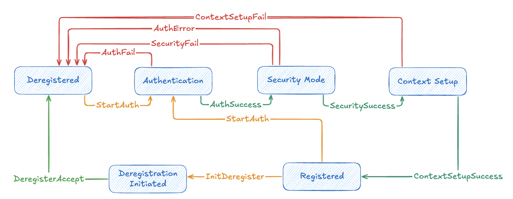

# 第 4 章：AMF 詳解

## 4.1 AMF 在核心網路中的角色

在 5G 核心網路中，AMF（**Access and Mobility Management Function，接入與行動性管理功能**）是所有 UE 進入 5GC 的「第一站」。當一支手機開機、發起註冊、建立 PDU 會話或移動到新的區域時，相關的控制訊號幾乎都會先經過 AMF，再由 AMF 與其他 NF（例如 SMF、AUSF、UDM、PCF 等）協調後續處理。

從功能角度來看，AMF 主要負責幾件事情：

- **接入控制與註冊管理**：處理 UE 的註冊（Registration）、更新與註銷（De-registration），決定是否允許某個 UE 使用網路。
- **行動性與連線管理**：追蹤 UE 所在的追蹤區（TA）、管理 RRC/NAS 連線狀態，協助完成切換（Handover）與重選（Reselection）相關流程。
- **安全與鑑權協調**：與 AUSF、UDM 等 NF 協作，完成 UE 的鑑權與安全上下文建立，確保訊號與資料在無線與核心網段之間的保護。
- **會話建立協調者**：在 UE 要建立 PDU 會話時，AMF 會根據策略與拓樸，選擇適當的 SMF，並協助建立 UE 與 SMF/UPF 之間的上下文。

在介面上，AMF 一手連接 **N1（UE ↔ AMF 的 NAS 訊息）**，一手連接 **N2（gNB ↔ AMF 的 NGAP 訊息）**，同時也透過 SBA 上的各種 Nn 介面與核心網內其他 NF 溝通。因此，你可以把 AMF 想像成「**5GC 控制平面入口的前台與交通指揮中心**」，負責把來自無線側的需求轉換成核心網內部的服務呼叫。

> [!Caution]
> NAS 雖然是 UE 與 AMF 之間的訊息，但依然是由 RAN 包裝在 NGAP 訊息裡面，透過 SCTP 連線來送入 AMF 的 N2 接口！並不是 UE 直接送到 AMF 上！

## 4.2 N2 介面與相關協定

## 4.2.1 N2

N2 介面是 5G RAN（gNB）與 5GC 控制面（AMF）之間的控制平面介面，主要承載：

- gNB 與 AMF 之間的訊號協調，例如 UE 附著、追蹤區更新、切換等程序
- 承載 UE 的 NAS 訊息，將其包**在 NGAP 訊息中轉送給 AMF 處理**

在協定堆疊上，N2 介面通常使用 IP 之上的 **SCTP** 作為傳輸層協定，在其上運行 **NGAP** 應用層協定，而 UE 與核心網之間的 **NAS** 訊息則被封裝在 NGAP 訊息中，透過 N2 轉遞給 AMF，如上面的協定堆疊圖所示。

### 4.2.2 SCTP

SCTP（Stream Control Transmission Protocol）是一種訊息導向、支援多路徑與多串流的傳輸層協定，在 5G N2 介面中被用來承載 NGAP 訊息。與一般常見的 TCP 相比，SCTP 的幾個特點特別適合電信訊號：

- **多串流（Multi-streaming）**：可以在一個連線中建立多個獨立的串流，減少 Head-of-Line Blocking 的影響，讓不同類型的訊號不會互相阻塞。
- **多歸屬（Multi-homing）**：一個端點可以綁定多個 IP 位址，在其中一條路徑故障時，可以快速切換到備援路徑，提高可靠性。
- **訊息導向與明確的訊息邊界**：比較符合「一則訊號一個 message」的使用模式，方便電信協定實作。

在實作上，gNB 與 AMF 會各自在 N2 專用的 IP/Port 上建立 SCTP 連線，後續所有 NGAP 訊息都透過這條連線交換。

### 4.2.3 NGAP

NGAP（Next Generation Application Protocol）是運行在 N2 介面上的應用層訊號協定，負責定義 gNB 與 AMF 之間各種控制流程使用的訊息格式與程序。常見的 NGAP 程序包括：

- Initial UE Message / Initial Context Setup：用於 UE 初次註冊或建立 PDU 會話時的上下文建立
- UE Context Release：釋放 UE 在 gNB/AMF 之間的上下文
- Handover Preparation / Handover Resource Allocation：執行 UE 在不同 gNB 之間切換時的訊號協調

在 free5GC 的 AMF 中，NGAP 模組會負責：

- 解碼由 SCTP 收到的 NGAP PDU
- 根據 PDU 類型分派到對應的處理程序（例如處理 Initial UE Message、UE Context Release 等）
- 從 NGAP 中取出 NAS 負載（N1 message），交給 NAS 處理邏輯

### 4.2.4 NAS

NAS（Non-Access Stratum）是 UE 與 5GC 之間的控制平面訊號層級，對 UE 來說，它是「直接跟核心網說話」的那一層。NAS 負責的內容包括：

- UE 註冊（Registration）、更新與註銷（De-registration）相關程序
- PDU 會話建立、修改與釋放的請求與回應
- 安全模式（Security Mode）、身份識別（Identity）等控制程序

在傳遞路徑上，NAS 訊息會：

1. 在 UE 與 gNB 之間，封裝在 RRC 訊息中傳輸；
2. 到達 gNB 後，由 gNB 透過 NGAP 將 NAS 負載包在適當的 NGAP 訊息內；
3. 經由 N2/SCTP 傳給 AMF，最後由 AMF 的 NAS 處理邏輯解碼與處理。

> [!Note]
> 在上面的協定堆疊圖中可以看到 NAS 訊息又分為兩種：
>
> - NAS-MM：UE 傳達資訊到 AMF 的訊息
> - NAS-SM：UE 傳達資訊到 SMF 的訊息，但 NAS-SM 依舊是由 AMF 接收後經由 SBI 送到 SMF 上

## 4.3 AMF 的啟動流程

> [!Note]
> 這裡的啟動流程適用於其他 SBI 上除了 NRF 以外的 NF，後續介紹其他 NF 時便不會在多做說明！

在 free5GC 的實作中，AMF 的啟動流程大致可以分成幾個步驟，整體架構與本書第 3 章介紹的通用 NF 結構相呼應：

1. **讀取設定與初始化 Logger**

    啟動程式會先載入 AMF 的設定檔（例如本機 IP/Port、PLMN/TA 列表、NRF 位址、SCTP 參數等），並依據設定初始化日誌系統，確保後續每個模組都能寫出一致格式的 log。

2. **建立 AMF 上下文（Context）**

    接著建立 AMF 的全域 context，內含：

    - 網路拓樸與 PLMN/TA 配置
    - 與其他 NF 溝通所需的 SBI client 設定
    - 內部使用的緩存、狀態表與計時器等

3. **初始化 SBI Server 與 NRF 註冊**

    AMF 會啟動自己的 SBI HTTP server，對外提供服務，同時作為 client 主動向 NRF 註冊自己的服務能力與位址，讓其他 NF 可以透過 SBA 機制發現並呼叫 AMF。

4. **啟動 N2（SCTP / NGAP）相關模組**

    啟動 N2 端口的 SCTP 監聽，初始化 NGAP 協定處理模組，準備接收來自 gNB 的 NGAP 訊息與其中所承載的 NAS 負載。

5. **進入事件迴圈，處理訊號與錯誤**  

    最後，AMF 會進入主事件迴圈，持續處理：

    - 來自 N2 的 NGAP / NAS 訊息
    - 來自其他 NF 的 SBI 請求
    - 內部計時器觸發與狀態機更新

當你在閱讀 AMF 原始碼時，可以對照上述步驟，從啟動入口程式一路追到設定載入、context 建立、SBI 註冊與 N2 監聽等關鍵程式碼。

## 4.4 AMF 的 FSM 狀態機

AMF 在實作上大量使用 **FSM（Finite State Machine，有限狀態機）** 來管理 UE 與訊號流程。原因很簡單：

對每一支 UE 而言，從「還沒上線」到「成功註冊、建立 PDU 會話、最後註銷離線」，其實就是在不同的狀態之間移動，而每個狀態只允許發生特定的事件與轉移。如果不用狀態機清楚描述，程式碼很容易變成一堆 if-else，既難閱讀也難維護。

目前 free5GC AMF 中的狀態機大致上可以用下面這張圖來看：

AMF 會從 UE 的起始非註冊狀態（Degistered）依照狀態機改變的邏輯來更新 AMF 中 UE context 的狀態。圖中三個顏色分別代表如下：

- 橙色：事件觸發，轉移到下一個狀態
- 綠色：事件成功，轉移到下一狀態
- 紅色：事件失敗，回覆到前面的某一個狀態（通常會回復到其實狀態）

> [!Tip]
> FSM 這個東西並不需要死背硬記，可以簡單這樣記：
>
> 1. 手機開機還沒註冊，準備開始註冊
> 2. 驗證雙方的基礎資料
> 3. 確認安全模式
> 4. 在 AMF 中建立 UE 的紀錄實例
> 5. 手機註冊成功！

## 4.5 AMF 的實際業務內容

> [!Note]
> 這邊會以 UE 的角度帶讀者了解 AMF 是如何處理 來自 UE 以及 RAN 的訊息，希望可以透過貼近日常生活的方式來新手也能很輕鬆的了解核網是如何處理這些資訊。

### 4.5.1 UE 註冊（Registration）

先從最常見、也最關鍵的「UE 註冊」流程開始。你可以把註冊想像成「在機場櫃檯辦理報到」：UE 把自己的身分與需求告訴 AMF，AMF 檢查沒問題後，幫它建立一份「旅客檔案」，之後所有動作都會以這份檔案為基礎。

從 UE 角度看，註冊大致會經歷這幾個步驟：

1. UE 開機或進入需要服務的狀態時，透過 RRC（UE 與 gNB 之間使用的協定） 與 gNB 建立連線，然後把 **Registration Request（NAS 訊息）** 交給 gNB。  
2. gNB 將這個 NAS 負載包在 Initial UE Message（NGAP）裡面，透過 N2/SCTP 傳給 AMF。  
3. AMF 收到後，根據註冊原因、PLMN/TA 資訊與 UE 能力，決定要不要接受這支 UE，並觸發與 AUSF/UDM 的鑑權、取得訂閱資料。  
4. 當安全與訂閱都 OK 後，AMF 回傳 Registration Accept 給 UE，同時在內部建立與這支 UE 對應的上下文（包含識別資訊、TA 列表、安全參數等）。

之後，只要 UE 還在「已註冊」狀態中，AMF 就會依照 FSM 設計處理各種更新與移動相關的事件。

### 4.5.2 UE PDU 會話建立（PDU Session Establishment）

完成註冊之後，UE 還需要建立至少一個 **PDU Session** 才能真正「上網」。可以把這看成是「在機場辦完報到後，還要領登機證並分配座位」：  
UE 告訴網路自己想要什麼樣的連線（例如用哪個 DNN/切片、走哪種 QoS），AMF 則負責幫它找到合適的 SMF/UPF，並完成整套路徑的建立。

從 UE 角度來看，PDU 會話建立的運作大致如下：

1. UE 發送 PDU Session Establishment Request（NAS-SM 訊息），內容包含 DNN、S-NSSAI、請求的 SSC mode 等資訊，透過 N2 傳到 AMF。  
2. AMF 檢查 UE 當前註冊與安全狀態，並依據策略與拓樸選擇一個合適的 SMF（可能會向 NRF 查詢可用的 SMF 實例）。  
3. AMF 透過 SBI 向選定的 SMF 發出建立 PDU Session 的請求（例如 Nsmf_PDUSession_Create），並等待 SMF 回覆分配的 IP 位址、UPF 資訊與 QoS 相關設定。  
4. 最後，AMF 透過 NAS 回覆 UE（PDU Session Establishment Accept），同時協調 gNB 完成對應的 N3/N9 路徑與 QoS 設定。

在這個流程中，AMF 比較像是「**代辦與協調者**」：並不直接處理使用者平面的封包，但負責把 UE 的服務需求轉成 SMF/UPF 端實際的路由與資源分配。

### 4.5.3 UE 註銷（De-registration）

每一段旅程終究會結束：當 UE 關機、主動切斷連線，或因為長時間未活動被網路主動釋放時，就會進入 **註銷（De-registration）** 流程。這一步的目的，是幫 UE 與網路雙方把還在使用的資源好好收尾。

從 UE 角度來看，註銷流程大致包含：

1. UE 主動送出 Deregistration Request（NAS-MM 訊息），或在某些情況下由網路側觸發註銷程序。  
2. AMF 收到後，會：

    - 通知相關的 SMF/UPF 釋放對應的 PDU 會話與資源  
    - 更新自身的 UE 上下文狀態（從「已註冊」切回「未註冊」）  
    - 在必要時向其他 NF（例如 PCF、UDM）清除暫存狀態

3. 最後，AMF 回覆 De-registration Accept 給 UE，表示這次「旅程」正式結束。

透過完整的註銷程序，網路才能確保資源被正確回收，不會因為異常離線或逾時而留下無用的上下文與 QoS 配置。

### 4.5.4 其他業務

除了上述幾個最常見、最核心的流程之外，AMF 還會處理許多與行動性與接入相關的業務，例如：

- 追蹤區更新（Tracking Area Update, TAU）與相關計時器管理
- Paging（呼叫閒置狀態 UE）與服務請求流程
- 換手（Handover）

這些業務在日常網路運作中扮演重要角色，但在本書中，我們會先聚焦在「**註冊、PDU 會話、註銷**」這三條主幹流程，讓讀者先把 AMF 與 UE 之間的核心互動搞清楚，後續想要再更深入的研究其他功能時也能更容易的入手。

## 4.6 本章小節

本章說明了 AMF 作為 UE 進入 5GC 的「第一站」，如何一手連接 N1/N2 訊號，一手透過 SBA 與 SMF、AUSF、UDM、PCF 等 NF 協作，完成接入控制、行動性管理、安全協調與 PDU 會話建立等工作。

接著，我們透過 N2 協定堆疊（SCTP/NGAP/NAS）、啟動流程與 FSM 狀態機，從實作角度拆解 AMF 處理訊息與管理 UE 生命週期的方式。

最後，本章以 UE 視角走過註冊、PDU 會話與註銷三條主幹流程，並點出 TAU、Paging、Handover 等其他業務，為後續深入 SMF、UPF 等 NF 的章節建立必要的背景。

  <a href="../chapter5/" class="nav-btn nav-next" title="下一章：SMF、UPF 與使用者面流程">
    
  </a>

