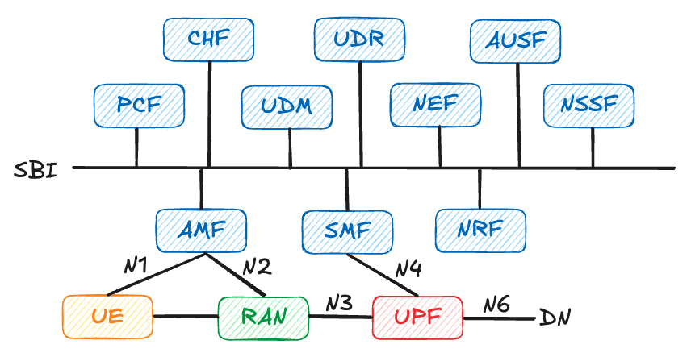

# 第 6 章：其他網路元件

在第 4 章以及第 5 章我們了解了 AMF/SMF/UPF 這三個最主要的核心 5G 網路元件，接下來我們將依序介紹其他功能相對簡單但依舊重要的網路元件！本書不會很詳細的去講每一個網路元件裡面的每一個功能，但透過介紹主要功能的方式讓讀者了解這些網路元件在 5G 中扮演著什麼樣的角色。

## 6.1 AUSf

AUSF（Authentication Server Function）是 5GC 中負責 **用戶鑑權** 的核心網元。當 UE 發起註冊程序時，AMF 會將相關的身份資訊（如 SUCI、SUPI）轉給 AUSF，AUSF 再與 UDM 配合，根據用戶的鑑權向量與金鑰資料，完成 5G-AKA 或 EAP-AKA’ 等鑑權程序。

在 free5GC 的實作中，AUSF 主要負責：

- 接收來自 AMF 的鑑權請求，選擇適當的鑑權方法
- 向 UDM 查詢並產生鑑權向量（Authentication Vector, AV）
- 驗證 UE 回傳的鑑權回應是否正確，並產生後續安全所需的上下文資訊

你可以把 AUSF 想像成「專門負責核對身分與密碼」的後端服務，而 AMF 則是把 UE 帶到櫃檯來驗證的那一端。

> [!Note]
> 5G-AKA (Authentication and Key Agreement) 是一種驗證與散佈 UE 與 5G 營運商之間共享密鑰的一種機制。

## 6.2 CHF

CHF（Charging Function）負責 **計費與使用量統計相關的邏輯**，在 5GC 中通常與 SMF、UPF 等網元搭配，針對不同服務與切片紀錄使用量與事件。在許多實作中，CHF 會搭配現有的計費系統或資料庫，提供即時計費（online charging）與離線計費（offline charging）所需的介面。

在 free5GC 的架構裡，CHF 的功能相對簡化，主要用於：

- 接收 SMF / UPF 透過 URR 報上來的使用量資訊
- 以事件為單位記錄與輸出，方便後續分析或整合到外部系統

雖然本書不會深入實作每一種計費場景，但理解 CHF 的角色，有助於你在閱讀 PDU 會話與 URR 配置時，知道這些統計資訊最終會被送到哪裡。

## 6.3 NEF

NEF（Network Exposure Function）是一個 **「把 5G 核心能力包裝成 API 對外開放」** 的網元。它的主要目標，是讓第三方應用或企業系統，在安全、受控的前提下，能夠使用到 5GC 的某些能力，例如：

- 查詢或訂閱某些事件（如 UE 狀態變化、位置變化）
- 透過受控接口調整部分策略或服務行為

在 free5GC 中，NEF 的實作與實際商用系統相比較為簡化，但它提供了一個很好的框架，讓你理解 5G 是如何把「電信網」變成「可被應用程式呼叫的服務」。對於想要把 5G 核心與自家系統整合的讀者來說，NEF 是非常重要的概念入口。

## 6.4 NRF

NRF（Network Repository Function）是 5GC SBA 架構中的 **「服務登錄中心與目錄服務」**。所有 NF（包含 AMF、SMF、UPF、PCF、AUSF 等）在啟動時，會向 NRF 註冊自己的服務類型、位址與狀態；而當某個 NF 想要呼叫其他 NF 時，則會先向 NRF 查詢可用的服務實例。

在 free5GC 中，NRF 主要負責：

- 接收與維護各 NF 的註冊資訊
- 提供服務發現（Service Discovery）功能，讓 NF 之間可以用服務名而非硬編碼 IP 互相呼叫

如果把 5GC 想像成一組微服務系統，NRF 的角色就很像是「服務註冊中心 + 簡易的服務目錄」，是整個 SBA 能順利運作的關鍵之一。

> [!Note]
> 舉例 AMF 向 SMF 發起 PDU 會話的建立請求，流程大致如下：
>
> 1. SMF 於啟動時向 NRF 註冊其位址與其服務
> 2. NRF 接收 SMF 的註冊請求
> 3. AMF 收到 來自 UE 的 PDU 會話建立請求
> 4. AMF 向 NRF 詢問 SMF 的位址與 JWT 驗證 token
> 5. AMF 用取得的位址與 JWT 向 SMF 正式發起請求

## 6.5 NSSF

NSSF（Network Slice Selection Function）負責 **協助選擇合適的網路切片（Slice）**。當 UE 註冊或建立 PDU 會話時，AMF 與 SMF 會根據 UE 的訂閱資訊、服務需求與網路配置，決定應該把它放到哪一個切片；在這個過程中，NSSF 會提供建議與決策支援。

在 free5GC 的實作中，NSSF 的邏輯同樣較簡化，但整體概念仍然保留：

- 根據 UE 的 S-NSSAI 請求與訂閱資料，判斷哪些切片可用
- 協助 AMF / SMF 進行切片選擇與對應的 NF 選路

對於需要多租戶或企業專網場景的讀者來說，理解 NSSF 的角色，有助於你設計「同一套 5GC，服務不同客戶與業務」的架構。

> [!Note]
> S-NSSAI（Single Network Slice Selection Assistance Information）邏輯上由兩個欄位組成：
>
> 1. **ST（Slice/Service Type）**：用來表示「這條切片的大類型」，例如 eMBB、URLLC、mMTC 等。3GPP 規範中通常以一個 8-bit 的數值來區分不同的服務類型（例如 1 = eMBB，2 = URLLC，3 = mMTC），營運商也可以自行定義其他數值代表特定業務類別。
> 2. **SD / SSD（Slice Differentiator）**：用來在「同一種 ST 類型」下面，再進一步區分不同的實際切片實例。3GPP 標準名稱為 SD（24-bit），有些實作或文件會寫成 SSD，本書在描述概念時統一稱為 SSD。透過 SSD，營運商可以在同一 ST 之下建立多個邏輯獨立的切片，例如多個不同企業專網。

## 6.6 PCF

PCF（Policy Control Function）是 5GC 中的 **「策略中樞」**，負責管理與下發與 QoS、接入控制、路由選擇與計費相關的策略。當 SMF、AMF 或其他 NF 在處理 UE 流量或會話時，如果需要決定「這條流量該給多少頻寬、允不允許進特定 DNN、應該用哪個計費方案」，通常都會透過 SBI 向 PCF 請求策略。

在 free5GC 中，PCF 會：

- 儲存一組相對簡化的策略與 QoS 配置（例如對特定 DNN / Slice 的預設 QoS）
- 接收 SMF/AMF 的查詢，回傳對應的策略結果（如 QoS Profile、Policy Rule）

你可以把 PCF 想像成「整個 5GC 的規則資料庫與決策服務」，前面第 5 章中介紹的 PDR/FAR/QER/URR，很多就是在這裡被定義或影響，再由 SMF 轉譯成 UPF 可執行的規則。

## 6.7 UDM

UDM（Unified Data Management）是 5GC 中主要的 **用戶訂閱資料與部份狀態的管理中心**。它大致承襲了 4G 時代 HSS 的角色，但在 5G 中被重新設計，以更符合 SBA 與雲原生架構。

UDM 的主要職責包括：

- 儲存與提供用戶的基本資料（SUPI、服務權限、漫遊權限等）
- 與 AUSF 合作，提供鑑權所需的金鑰與鑑權向量資訊
- 為 AMF、SMF 等網元提供與訂閱相關的查詢服務（例如可用的切片、允許的 DNN 等）

在 free5GC 中，UDM 常與資料庫（如 MongoDB）搭配使用，你在部署與測試時會經常與它打交道，特別是在修改用戶資料或測試不同策略組合時。

## 6.8 UDR

UDR（Unified Data Repository）可以視為 **5GC 中更通用的資料儲存層**，用來存放各種由不同 NF 管理的資料，如訂閱資料、策略資訊或應用相關資料。UDM、PCF 等 NF 可以把自己的資料持久化在 UDR 中，透過標準化的介面進行存取。

在某些實作中，UDM 會被視為「邏輯上的用戶資料管理服務」，而實際的資料則存放在 UDR；PCF 也可以利用 UDR 來儲存策略配置。對於讀者而言，只要記得：UDR 主要解決的是「資料如何統一儲存與存取」的問題，而不是直接參與訊號流程。

> [!Caution]
> 很容易把 UDM 和 UDR 搞混，可以用一句話來區分：
>
> - **UDM 是「會思考的服務」**：提供 API、實作 5GC 規範裡關於用戶資料與鑑權的邏輯（誰能用、怎麼驗證、允許哪些切片/DNN 等）。
> - **UDR 是「會存東西的資料庫」**：專注在統一儲存各種 NF 的資料（包含 UDM 的資料），本身不負責 5GC 訊號流程與決策邏輯。

## 6.9 Web console

根據 3GPP 的規定，5G 系統應提供統一的 OAM（Operations, Administration and Maintenance）介面，讓營運者可以管理用戶資料、監控網路狀態並收集各種統計與計費資訊。free5GC 並沒有實作一套完整、符合所有標準的 OAM 平台，但提供了一個實用的 **Web Console（網頁管理介面）** 作為輕量版的 OAM 解決方案。

在 free5GC 的實作中，這套 Web Console 主要具備兩類功能：

- **資料管理與配置**：透過前端頁面直接對後端的 MongoDB 進行操作，包含：

    - 新增、刪除或修改 UE（使用者）資料與相關訂閱設定
    - 管理切片（S-NSSAI）、DNN、策略等與用戶相關的靜態配置

- **狀態監控與報表輸出**：在核心網啟動並運作時，Web Console 及其後端元件可以：

    - 透過與 CHF 建立 FTP 或其他方式的連線，收集並匯出 UE 使用量與計費相關報告，方便後續分析或對接外部系統

對於正在學習或實驗 free5GC 的讀者來說，這套 Web Console 的重點是提供一個直覺的圖形介面，協助你更輕鬆地管理 MongoDB 中的用戶與策略資料，並觀察系統在實際運作時產生的各種統計與計費資訊。

## 6.10 本章小結

本章簡要介紹了 AUSF、CHF、NEF、NRF、NSSF、PCF、UDM、UDR 以及 free5GC 的 Web Console，這些元件雖然不像 AMF/SMF/UPF 那樣直接參與每一條訊號與資料路徑，但卻分別在鑑權、安全、策略、計費、切片選擇與資料管理等面向扮演關鍵角色。理解它們的職責與互動關係，有助於你在後續閱讀程式碼或設計實驗拓樸時，不會只看到「幾個主要 NF」，而能把整個 5GC 當成一個完整且可擴展的系統來思考。

  <a href="../chapter7/" class="nav-btn nav-next" title="下一章：非 3GPP 接入">
    
  </a>

