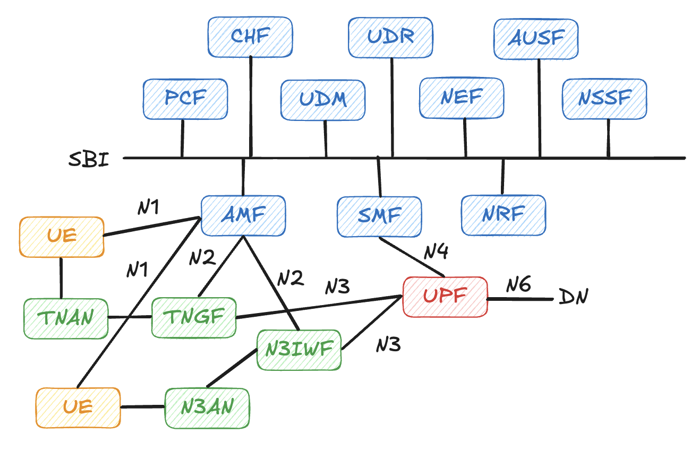
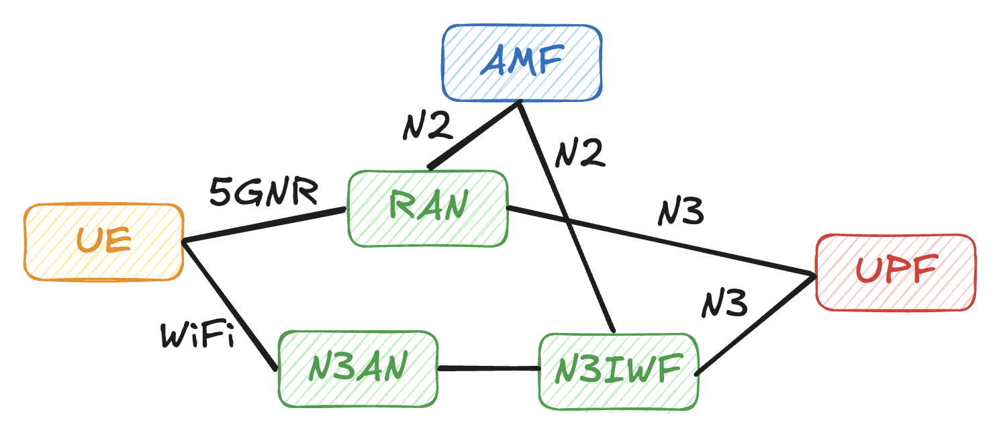

# 第 7 章：非 3GPP 接入

在 5G 核心網路的系統中，除了一般的 3GPP 接入以外，為了結合現有的常見網路架構，規格書中還特別定義了**非 3GPP 接入**的功能，簡單來說就是可以**透過 WiFi 的方式接入 5G 核心網路**。

在 3GPP 中又將 WiFi 的接入功能分為**可信任（TNGF）**與**不可信任（N3IWF）**兩種（如下圖所示），接下來我們將分別介紹這兩種的接入方式與功能。實務上，這兩種接入都會在 UE 與 5GC 之間再加上一層 **非 3GPP Access Network（AN，例如 Wi‑Fi AP + 匯聚交換器/IP 網路）+ TNGF / N3IWF** 的組合，你可以把這個組合視為「對 5GC 來說的另一種 RAN」。

## 7.1 TNGF

TNGF（Trusted Non-3GPP Gateway Function）顧名思義，是針對「**可信任的非 3GPP 網路**」所設計的接入閘道。這類網路通常是由同一個營運商、或是與營運商有緊密合作關係的業者所建置與管理，例如：

- 電信商自建的 Wi-Fi 熱點（Hotspot）
- 企業與電信商共同規劃的專網 Wi-Fi

在這種情境下，營運商可以信任 Wi-Fi 網路本身的部署與管理，因此在安全架構上可以相對簡化，將「非 3GPP AN + TNGF」這個組合視為類似 3GPP RAN 的一種延伸，透過 TNGF 把非 3GPP 接入整合進 5GC。

從功能角度來看，TNGF 主要負責：

- 在 UE 與 5GC 之間，建立並維護透過非 3GPP 網路的使用者面與控制面通道
- 與 5GC（特別是 AMF/SMF）協調 UE 的註冊、PDU 會話建立與管理
- 在需要時，負責與 Wi-Fi 端的 AAA / 認證系統配合，完成 UE 的接入驗證

在「可信任」的前提下，TNGF 相關的安全設計通常有幾個重點：

- **接入層保護**：非 3GPP AN 端仍需採用企業級 Wi‑Fi 安全機制（如 802.1X/Enterprise、WPA2/WPA3‑Enterprise），並與營運商的 AAA/鑑權系統串接，避免任意終端直接進入接入網。
- **網路邊界防護**：TNGF 所在區域通常會與其他 IT 網路做明確網段與防火牆區隔，避免非 3GPP AN 被當成一般內網隨意連通。
- **與 5GC 的信任關係**：TNGF 與 5GC 之間的 SBI/N2/N3 連線，仍需依照一般 NF 間的安全要求配置憑證與 TLS/IPsec，確保「被信任的」只是一個受控的接入網，而不是放棄核心網邊界的保護。

> [!Tip]
> 簡單來說，當 Wi-Fi 網路可以被營運商視為「自己的延伸」時，就會走 TNGF 這條路。

## 7.2 N3IWF

N3IWF（Non-3GPP InterWorking Function）則是為了支援「**不可信任的非 3GPP 網路**」而設計，最典型的例子就是 **公共 Wi-Fi** 或各種使用者自行接入的網路（例如家用路由器、咖啡店熱點等）。在這種情況下，5GC 不能信任 Wi-Fi 網路本身，因此必須：

- 將 UE 視為從「不可信任的 IP 網路」接入
- 透過 **IPsec / IKEv2** 為 UE 與 N3IWF 之間建立加密的隧道
- 再透過這條安全隧道，把 NAS 與使用者面的流量導入 5GC

整體流程可以簡單想像成：

1. UE 先連上某個 Wi-Fi 或有線 IP 網路，取得 IP 位址（這一步與一般上網無異）。  
2. UE 啟動與 N3IWF 之間的 IKEv2 / IPsec 交握，建立加密通道。  
3. 在這條 IPsec 隧道裡，UE 與 AMF 之間開始傳遞 NAS 訊息，等同於「透過非 3GPP 網路遠端連入 5GC」。  
4. 後續的註冊、PDU 會話建立與使用者面封包，都會在這條隧道內被封裝與轉送。

在 free5GC 專案中，N3IWF 有對應的模組與實作，常被用來示範「透過 Wi-Fi / Internet VPN 的方式，把 UE 連到 5GC」的場景。從 5GC 的視角來看，可以把「非 3GPP AN + N3IWF」這個組合抽象成另一種 RAN，只是它是建構在 IPsec/VPN 之上的「虛擬 RAN」。

N3IWF 的安全關鍵在於「雙層防護」：

- **外層 IPsec / IKEv2**：透過憑證與金鑰建立 UE 與 N3IWF 之間的加密隧道，確保即使 Wi‑Fi 或中間 IP 網路完全不可信，攻擊者也無法直接竊聽或篡改 5G 訊號與使用者面流量。
- **內層 5G‑AKA / EAP‑AKA' 等機制**：在 IPsec 隧道內，UE 仍需透過 5G 核心網的鑑權程序向 AUSF/UDM 證明身分，這一層決定「你是誰、能不能用這張網」。
- 在實作與實驗時，雖然可以用自簽憑證與簡化配置方便測試，但在接近實務的環境中，仍建議使用正式的 PKI、嚴格管理 N3IWF 憑證與金鑰，避免 N3IWF 本身變成攻擊者的入口。

> [!Tip]
> 若你熟悉傳統的 VPN 架構，可以把 N3IWF 想像成「專門為 5G UE 準備的 VPN Gateway」，只不過隧道裡跑的不是一般企業流量，而是 5G 的 NAS 與使用者面流量。

## 7.3 ATSSS

ATSSS（Access Traffic Steering, Switching and Splitting）是 5G 為了支援「**多接取路徑下的智慧流量控制**」而提出的機制。簡單來說，就是讓同一支 UE 可以同時透過 3GPP 接入（例如 5G NR）與非 3GPP 接入（例如 Wi-Fi/N3IWF），並由核心網與 UE 共同決定：

- 某條流量應該走哪一條路徑（Steering）
- 在某條路徑品質變差時是否要切換到另一條（Switching）
- 或者同時使用多條路徑分流傳送（Splitting）

從架構角度來看，ATSSS 涉及：

- 在 UE 端的多通道支援與流量分類（通常需要特定的 UE 堆疊配合）
- 在 5GC 中由 SMF/UPF、PCF 協同決定路徑與策略（例如根據應用類型、QoS、當前路況選擇 3GPP、非 3GPP 或兩者同時）

free5GC 在過去幾年的社群實驗中，也曾經展示過「**N3IWF + 3GPP 的雙連線 ATSSS 範例**」：  
UE 一方面透過 5G NR 連上 gNB，另一方面透過 Wi-Fi 與 N3IWF 建立 IPsec 隧道，兩條路徑最後都匯聚到同一個 5GC/UPF，由核心網依據策略將部分流量導向 3GPP，部分流量導向非 3GPP，或在兩者之間進行分流。這樣的組合提供了一個很好的實驗平台，讓你實際體驗「多接取、多路徑」在 5G 核心網中的運作方式。

## 7.4 本章小結

本章簡要介紹了 5G 核心網路支援的「非 3GPP 接入」與多接取流量控制機制：TNGF 與 N3IWF 分別對應可信任與不可信任的 Wi-Fi / IP 網路接入，而 ATSSS 則進一步在 3GPP 與非 3GPP 之間做流量的導向、切換與分流。理解這些機制，有助於你在設計或實驗 5G 網路時，思考「除了 3GPP RAN 之外，還有哪些路徑可以把裝置安全且彈性地帶進 5GC」，以及如何善用多條路徑來提升體驗與可靠度。

  <a href="../../part3-deploy/chapter8/" class="nav-btn nav-next" title="下一章：free5GC 部署實戰">
    
  </a>

