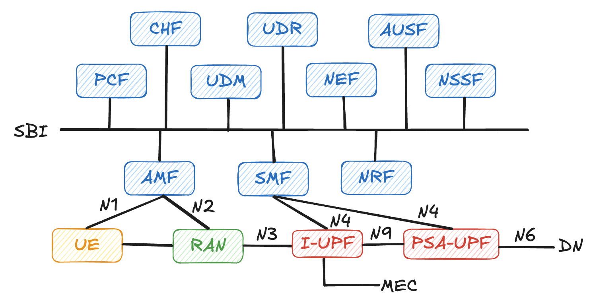

# 第 9 章：多節點 / 多 UPF 部署

在前一章中，我們已經完成了一套「所有 NF 都放在同一台機器」的基本 free5GC 部署。這種單節點架構非常適合教學與小規模實驗，但在實際網路設計中，5G 的一大特點就是**支援控制面與使用者面的分離（CUPS），以及多 UPF、甚至分層 UPF 的彈性部署能力**。本章將從概念出發，說明多節點 / 多 UPF 的架構與 ULCL（Uplink Classifier） 的角色，最後再簡單帶到在 free5GC 中如何實作這樣的部署。

## 9.1 為什麼需要多 UPF 部署？

在 5GC 的設計中，控制面 NF（例如 AMF、SMF、PCF 等）和使用者面 NF（UPF）是刻意分離的，這讓營運商可以依照不同需求與場景，靈活決定 UPF 的數量與位置。例如：

- **流量就近分流**：在不同地理區域各自放一個或多個 UPF，讓當地 UE 的流量在本地就能「下車」，減少回程延遲。
- **邊緣計算（MEC）**：在邊緣節點部署 UPF，直接把部分流量導向邊緣應用伺服器，而不是全部回到核心資料中心。
- **多租戶或多服務分隔**：為不同企業專網、不同業務類型（例如視訊、IoT）配置不同的 UPF，搭配切片與策略做更精細的流量控制。

要達到這些目標，5G 在 UPF 架構上引入了「多節點、多層級」的概念，其中一個關鍵元件就是 **ULCL（Uplink Classifier）**。

## 9.2 什麼是 ULCL（Uplink Classifier）？



ULCL 可以被視為一種「具備分流能力的 UPF 節點」，它的主要任務是在**上行方向（UE → 網路）根據特定規則，把流量分配到不同的下游 UPF 或資料網路**。從功能上看，它仍然是 UPF 的一種，但在拓樸位置與規則設計上，扮演的是「匯入點與分流器」的角色。

從 3GPP 的角度來看，ULCL 具備以下幾個特徵：

- **位於上游、靠近 RAN 或接入網的一側**：通常會接在 gNB 或 N3IWF 的下游，作為 UE 上行流量進入 5GC 的第一個 UPF。
- **根據 5‑tuple、DNN、S-NSSAI 或其他欄位做分類**：透過 PDR（Packet Detection Rule）與相關規則，判斷某個封包應該被送往哪一個下游 UPF。
- **可以同時連到多個下游 UPF**：例如一條路徑往「一般 Internet」，另一條路徑往「企業專網」或「邊緣應用」。

如果用一個生活化的比喻，ULCL 有點像是「高速公路交流道前的匯流站」：所有車子（上行封包）先來到這裡，再根據目的地與車種，被導向不同的高速公路出口。

在 free5GC 的實務部署中，ULCL 也常被用來實作：

- 將部分應用流量導向本地 MEC UPF，其餘流量走中央 UPF
- 依據不同 DNN / Slice，將流量分流到不同的企業專網 UPF

這些架構在後續多節點部署章節中會用圖示與設定範例再加以說明。

## 9.3 free5GC 多節點 / 多 UPF 部署

筆者這邊直接以官方提供的 ULCL 部署來做介紹，其核心主要就是在於配置 SMF 的資料平面資訊於實際啟動多個不同的 UPF 實例。

### 9.3.1 SMF 設定檔的改動

在 ULCL 的 SMF 設定中，最關鍵的區塊就是 `userplaneInformation`。這裡會宣告整個使用者面拓樸裡有哪些節點（`upNodes`），以及這些節點之間的連線關係（`links`）。以下是精簡後的範例，我們可以看到有三個 `upNodes`：

```yaml
userplaneInformation:
  upNodes:
    gNB1:
      ...
    I-UPF:
      ...
    PSA-UPF:
      ...
```

在這裡：

- `gNB1` 代表一個接入節點（對 N3 來的 gNB）  
- `I-UPF` 是上游的分流節點（ULCL）  
- `PSA-UPF` 則是下游的錨點 UPF（PDU Session Anchor）

透過這樣的宣告，SMF 就知道「資料平面上有哪些節點可以用」，以及之後要在 PDU 會話中如何選擇路徑。

接著，在 `userplaneInformation` 的 `links` 部分，我們可以用 `A` / `B` 來描述節點之間的連線關係：

```yaml
userplaneInformation:
  upNodes:
   ...
  links:
    - A: gNB1
      B: I-UPF
    - A: I-UPF
      B: PSA-UPF
```

這裡表示：

- `gNB1` 透過 N3 介面連到 `I-UPF`
- `I-UPF` 再往下游連到 `PSA-UPF`

SMF 啟動後會依據 `upNodes` 與 `links` 的資訊建立一張「使用者面拓樸圖」，之後在處理 PDU 會話與 ULCL 分流時，都會以這張拓樸為基礎來下發 PFCP 規則。

> [!Caution]
> `links` 裡面的節點名稱**必須**與 `upNodes` 中宣告的名稱完全一致（包含大小寫），否則 SMF 會找不到對應節點，最後導致 PDU 會話建立失敗或流量無法正確轉送。

### 9.3.2 UE 路徑設定

在 ULCL 的執行過程，我們可以透過事先定義規則的方式指定 UE 有哪些流量需要從 I-UPF 導出，而不經過 PSA-UPF，我們參考 `uerouting.yaml` 的設定：

```yaml
info:
  version: 1.0.7
  description: Routing information for UE

ueRoutingInfo:
  UE1:
    members:
      - imsi-208930000000001
    topology:
      - A: gNB1
        B: I-UPF
      - A: I-UPF
        B: PSA-UPF
    specificPath:
      - dest: 1.0.0.1/32
        path: [I-UPF]
```

這個設定檔做了幾件事：

- 在 `ueRoutingInfo` 底下，以 `UE1` 這個邏輯名稱代表一組 UE，`members` 中列出實際成員（這裡只有一個 `imsi-208930000000001`）。之後如果有更多 UE 要共用同一組路徑與分流規則，只要把 IMSI 加進這個清單即可。
- `topology` 描述這組 UE 的「預設資料平面拓樸」，也就是從 gNB1 經過 I‑UPF 再到 PSA‑UPF 的路徑，對應前面 SMF `userplaneInformation.links` 中宣告的連線關係。
- `specificPath` 則是 ULCL 的關鍵：它指定當這個 UE 的目的位址是 `1.0.0.1/32` 時，資料路徑只走 `I-UPF`，也就是在 I‑UPF 就直接「下車」，不再往 PSA‑UPF 轉送。換句話說，這條目的地流量會被 I‑UPF 分流出去（例如導向本地 MEC 或特定服務），而其他沒有特別指定的流量則仍依照預設拓樸經過 PSA‑UPF。

當 SMF 啟動並讀取 `uerouting.yaml` 後，就會依據這些設定在 ULCL‑UPF 上下發對應的 PDR/FAR 規則，讓 I‑UPF 能夠辨識「哪些封包應該依預設路徑走到 PSA‑UPF、哪些封包可以在自己這一層就被分流處理」。

## 9.4 本章小結

本章從 5GC 的 CUPS 架構出發，說明了為什麼在實務上常需要採用多節點、多 UPF 的部署方式，並以 ULCL 作為切入點，介紹了上行分流在 5G 核心網中的角色與典型應用情境。接著，我們透過 free5GC 官方的 ULCL 範例，解析了 SMF 設定檔中 `userplaneInformation.upNodes` 與 `links` 如何描述資料平面拓樸，以及 `uerouting.yaml` 如何針對特定 UE 與目的位址，定義哪些流量應該在 I‑UPF 直接分流、哪些則經由 PSA‑UPF 繼續轉送。

掌握這些概念之後，你應該已經能夠讀懂多 UPF / ULCL 架構下的主要設定與路徑設計邏輯，並理解「分流決策其實是由 SMF 透過 PFCP 在各個 UPF 上下發規則」這件事。未來在設計更複雜的拓樸（例如多層 UPF、MEC、企業專網或多切片場景）時，只要牢記這一章介紹的思維與設定方式，就可以在 free5GC 上逐步實作並驗證各種使用者面路徑的設計。

<div class="chapter-nav">
  <a href="../../part4-free-ran-ue/chapter10/" class="nav-btn nav-next" title="下一章：為什麼需要 RAN/UE 模擬器？">
    <span class="arrow"></span>
  </a>
</div>
