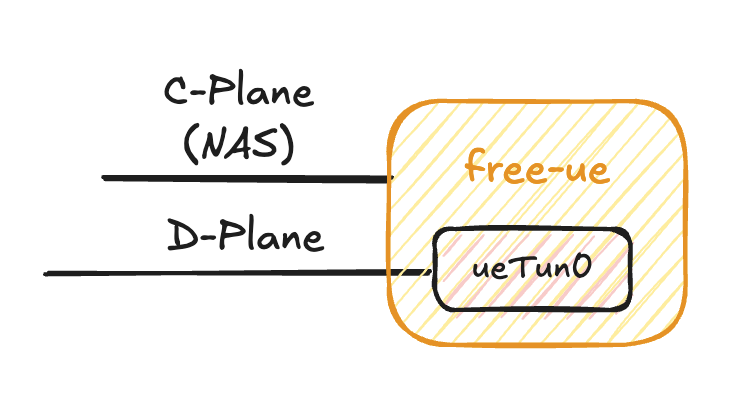
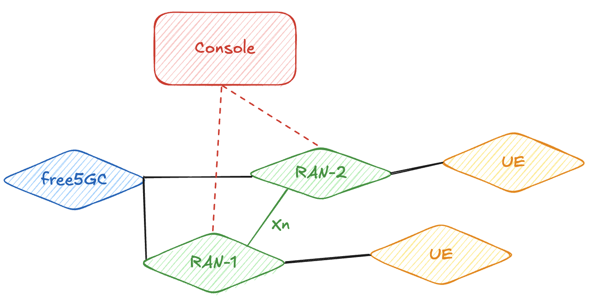

# 第 11 章：free-ran-ue 的架構設計

## 11.1 free-ran-ue 的設計理念


free-ran-ue 的核心目標，是為核心網使用者提供一套**輕量、可重現且穩定**的 RAN/UE 模擬器，用於控制面與資料面的各類測試。透過**分離式**的 RAN/UE 架構，它能更完整地模擬真實 UE 連線至 gNB 時的互動流程與資料轉送行為。

此外，free-ran-ue 也提供**可視化的 Web 管理介面**，協助使用者更直覺地管理與觀察模擬器中 UE 的連線狀態。

## 11.2 free-ran-ue 的程式架構

以下結構為 [free-ran-ue 主倉庫](https://github.com/free-ran-ue/free-ran-ue)結構：

```bash
.
├── cmd <= CLI 控制程式碼
├── config <= 使用者設定檔
├── console <= 可視化管理介面
├── constant <= 固定常數
├── gnb <= RAN（gNB）執行程式碼
├── logger <= 日誌工具
├── main.go <= 主程式入口
├── Makefile <= 編譯指令
├── model <= 設定檔結構模組
├── script <= 腳本
│   ├── 10k-test-script <= 大量 UE 腳本
│   └── namespace-script <= 命名空間腳本
├── ue <= UE 執行程式碼
└── util <= 工具函數包
```

## 11.3 RAN（gNB）


### 11.3.1 架構總覽

在 5G 系統裡，gNB 的角色可以用一句話概括：**把 UE 的控制面訊號與用戶資料，正確地接到核心網，並在需要時把資料轉送到對的地方**。  
在 free-ran-ue 中，RAN（gNB）同樣遵循這個精神，只是把「無線空口」用可控的方式抽象化，讓你能在不依賴實體基地台/真實 UE 的情況下，仍可重現註冊、建 session、送資料、切換/分流等典型流程。

你可以把 gNB 想成兩件事的組合：

- **控制面協定端點**：負責與 AMF 交握、承載 NGAP，並在 gNB 端維護 UE 的控制面上下文。
- **用戶面轉送器**：負責把 UE 送來的封包「封裝成 GTP-U」送往 UPF，並把 UPF 回來的 GTP-U 解封裝後送回 UE。

### 11.3.2 基礎連線

為了把控制面與資料面跑起來，gNB 需要維持四條最核心的連線/通道（從「對象」來看分成核心網與 UE 兩側）：

#### 對核心網（To Core Network）

- **控制面（Control Plane）**：gNB 透過 **NGAP** 與 **AMF** 溝通，用於 NG Setup、UE 註冊相關訊息、PDU Session 資源配置等。
- **資料面（Data Plane）**：gNB 透過 **GTP-U** 與 **UPF** 建立隧道，用於用戶資料的封裝/解封裝與轉送。

#### 對 UE（To UE / User Equipment）

- **控制面（Control Plane）**：承載 UE 的 **NAS** 訊號流程（例如註冊、建立 PDU Session 的控制訊息）。
- **資料面（Data Plane）**：承載 UE 的用戶資料封包（可視為「原始 IP 封包」的收發），由 gNB 負責對接到核心網的 GTP-U 隧道。

### 11.3.3 典型流程（從「跑通」到「可測」）

本小節用「你在測核心網時最常關心的流程」來理解 gNB 會做什麼；細節訊息欄位不展開，但會描述每一步的目的與結果。

#### (1) NG Setup：gNB 對 AMF 的「開機報到」

gNB 啟動後首先要讓 AMF 知道「我是一個可用的基地台」，因此會與 AMF 進行 NG Setup。
這一步的重點是建立基本協作關係（例如支援能力、服務的 PLMN、TAC 等），讓後續 UE 的註冊與 session 才有依據。

#### (2) UE 註冊：把 UE 的控制面狀態建立起來

當 UE 接入後，gNB 會承載 NAS 訊號並促成 UE 註冊流程。

從測試角度來看，這步完成後你通常會期待看到：AMF/UDM/AUSF 相關流程被正確觸發，且 gNB 端能維護該 UE 的控制面上下文。

#### (3) PDU Session 建立：為「資料面」把路鋪好

當建立 PDU Session 時，核心網會配置用戶面資源，gNB 端需要拿到對應的隧道資訊，讓 UE 的資料能被正確導向 UPF。

此處最關鍵的觀念是：用戶面通常以 **TEID** 做為隧道辨識與轉送依據。

#### (4) 資料面轉送：封裝/解封裝 + TEID 導向

一旦隧道建立完成，gNB 就能把 UE 上行封包封裝成 GTP-U 送到 UPF；下行則將 UPF 送來的 GTP-U 解封裝後送回 UE。
這也是做壓力測試、吞吐/時延測試、以及多 UE 並發時最核心的資料路徑。

### 11.3.4 Xn 介面

如果你要做兩個基地台之間交互相關的實作，就會需要 gNB 與 gNB 之間能交換「用戶面該怎麼分流/轉送」的必要資訊。

在 free-ran-ue 的現階段實作裡，Xn 的重點放在：**交換 TEID 與必要的轉送資訊**，讓 offload 的用戶面封包能被正確處理。

每個 gNB 的 Xn 介面會監聽在 YAML 設定檔指定的位址與埠號，例如：

```yaml
xnIp: "10.0.1.2"
xnPort: 31415
```

此 listener 使用 **TCP**。從使用者角度，你只要知道「Xn 的位址/埠號可在設定檔指定」，而後續要擴充更多 Xn 交互操作時，直接從 Xn 的訊息交換與轉送邏輯著手即可。

### 11.3.5 gNB 端如何記錄 UE

- **一般 UE（由本 gNB 直接服務）**：需要同時記住控制面的識別資訊（例如與 AMF 協作時的對應 ID），以及資料面的隧道資訊（上/下行 TEID、UE 的資料面位址等）。
- **Xn UE（由其他 gNB offload 而來）**：更偏向「資料面轉送」用途，重點是 TEID 與資料面位址，讓封包能在核心網與 UE 之間被正確轉發。

## 11.4 UE



本節從「UE 端實際需要做什麼」的角度，說明 free-ran-ue 的 UE 模組如何與 gNB 互動，以及在控制面/資料面上的分工。

### 11.4.1 基礎連線（UE ↔ gNB）

UE 連到 gNB 後，會有兩條核心連線（或可理解成兩個通道）：

- **控制面（Control Plane）**：用於信令傳遞、驗證（authentication）、以及 session 管理相關流程。
- **資料面（Data Plane）**：用於使用者資料傳輸；資料會透過已建立的 PDU Session 進行收發。

### 11.4.2 典型流程（Procedures）

以最常見的測試情境來看，UE 端通常會依序經歷：

- **UE Registration**：初始註冊流程，讓 UE 附著到 5G 網路並建立控制面狀態。
- **PDU Session Establishment**：建立用戶面資料連線（PDU Session）與本地的 5G 核心網路入口網卡（`ueTun0`），使 UE 能進行資料面通信。

### 11.4.3 GTP-U 的分工（UE 不處理 GTP）

在 free-ran-ue 的設計中，**UE 端不參與任何 GTP 程序**。

所有與 **GTP-U** 相關的封裝、解封裝與隧道處理，皆由 **gNB 端**負責完成（UE 端只需要專注在「控制面信令」與「原始用戶資料」的產生與接收）。

## 11.5 Web Console



free-ran-ue 提供的 console 實際上是一個透過持續打 gNB 上的 API 獲取資訊的介面系統。透過在 console 上設定需要被管理的 gNB，console 後端會直接向目標 gNB 拉取狀態，包含 gNB 自身的運作資訊與其連接的 UE 資訊，並將這些資料以可視化方式呈現，降低整合測試時的觀測成本。

從「使用者體驗」的角度，Web Console 解決的是一個很實際的痛點：當你同時在跑多個 gNB、多個 UE、甚至多種情境腳本時，若只靠 terminal log，很難在短時間內回答「現在到底連了幾台 UE？哪一台卡在哪個流程？資料面有沒有在跑？」這類問題。Console 讓你能以「狀態面板」的方式快速定位問題，再回頭用 log/trace 做細查。

### 11.5.1 運作方式（Polling / Pull-based）

Console 採用「由 Console 主動拉取（pull）」的方式取得資料，而不是由 gNB 主動推送（push）。這種設計的好處是：

- **部署更簡單**：只要 Console 能連到 gNB 的 API，就能開始管理與顯示狀態。
- **多 gNB 管理一致**：新增一個要管理的 gNB，本質上就是新增一個 API 來源。
- **對測試流程友善**：在 CI 或測試環境裡，pull 模式通常更容易穿越網路限制與 NAT/防火牆規則。

### 11.5.2 常見可觀測資訊

- **gNB 資訊**：基本配置、執行狀態、已建立的核心網/用戶面對接狀態等。
- **UE 清單與狀態**：已連線 UE 數量、UE 的註冊/Session 狀態、以及與資料面相關的關鍵資訊（例如是否已建立對應的資料路徑）。

## 11.6 本章小結

本章從架構視角拆解 free-ran-ue 的三個核心組件：RAN（gNB）、UE 與 Web Console。你可以把它們理解成一條完整的「可測試資料路徑」：UE 產生控制面/資料面行為，gNB 負責承接並把控制面對接到 AMF、把資料面透過 GTP-U 對接到 UPF，而 Console 則提供一個更容易觀察與管理整體狀態的入口。

在閱讀完本章後，建議你至少掌握以下幾個重點：

- **控制面與資料面的分工**：UE 端專注於信令與用戶資料；GTP-U 的封裝/解封裝與隧道處理由 gNB 端負責。
- **典型流程的觀察點**：UE 註冊完成代表控制面上下文建立；PDU Session 建立完成後，才具備穩定的資料面傳輸路徑（例如 `ueTun0` 的資料流）。
- **Console 的定位**：以 pull/polling 的方式向 gNB API 拉取狀態，讓你能快速掌握 gNB/UE 連線概況並縮短除錯時間。

下一章將在這個架構基礎上，帶你把 free-ran-ue 實際接到 free5GC：包含配置、啟動順序、以及常見整合問題與排查方向，讓模擬器真正成為可重複使用的系統測試工具。

<div class="chapter-nav">
  <a href="../chapter12/" class="nav-btn nav-next" title="下一章：模擬器如何與 free5GC 整合">
    <span class="arrow"></span>
  </a>
</div>
