# Userspace GTP-U

## Introduction

In current open source RAN and UE simulators, the GTP-U function is usually implemented in the kernel space. For example, [PacketRusher](https://github.com/HewlettPackard/PacketRusher) uses the [gtp5g](https://github.com/free5gc/gtp5g) kernel module to handle GTP packet forwarding.

However, if we want more flexible control over GTP-U, moving it to user space is a better choice. The goal of this project is to test the dynamic NR-DC feature in [free5GC](https://github.com/free5gc/free5gc). Although moving GTP-U to user space may incur some performance overhead, it offers greater flexibility for development and testing.

## Intuition

Here is an example of ICMP process, i.e. `ping`.

### Uplink

```mermaid
graph LR
  UE_Kernel(["<b>UE Kernel</b><br/>ping 8.8.8.8"])
  TUN(["<b>TUN<br/>ueTun0</b>"])
  UE_Sim(["<b>UE Simulator</b>"])
  RAN_Sim(["<b>RAN Simulator</b>"])
  UPF(["<b>UPF</b><br/>UDP 2152"])

  UE_Kernel -.->|"ICMP Packet"| TUN
  TUN -- "User Data" --> UE_Sim
  UE_Sim -- "TCP" --> RAN_Sim
  RAN_Sim -- "Encapsulate GTP-U <br/> with TEID" --> UPF

  %% 樣式美化
  classDef kernel fill:#e3f2fd,stroke:#1976d2,stroke-width:2px;
  classDef tun fill:#fffde7,stroke:#fbc02d,stroke-width:2px;
  classDef sim fill:#e8f5e9,stroke:#388e3c,stroke-width:2px;
  classDef ran fill:#f3e5f5,stroke:#8e24aa,stroke-width:2px;
  classDef gtpu fill:#fbe9e7,stroke:#d84315,stroke-width:2px;
  classDef upf fill:#ede7f6,stroke:#5e35b1,stroke-width:2px;

  class UE_Kernel kernel;
  class TUN tun;
  class UE_Sim sim;
  class RAN_Sim ran;
  class GTPU gtpu;
  class UPF upf;
```

1. Create a TUN device in the UE to serve as a virtual network interface for user traffic.
2. The UE reads packets from the TUN device in user space and sends them to the RAN simulator via TCP.
3. The RAN simulator receives the data from the UE, encapsulates the packets as GTP-U packets with the assigned TEID.
4. The RAN simulator sends the encapsulated GTP-U packets to the UPF over UDP (port 2152).

### Downlink

1. When the UPF has data to send to the UE, it encapsulates the data into a GTP-U packet and sends it via UDP (port 2152) to the RAN simulator.
2. The RAN simulator receives the GTP-U packet, decapsulates it based on the TEID, and forwards the original IP packet to the corresponding UE.
3. The UE simulator receives the packet in user space and writes the raw packet into the TUN device.
4. The UE kernel processes the packet and generates a response (e.g., ping reply).

## Implementation

## Conclusion
