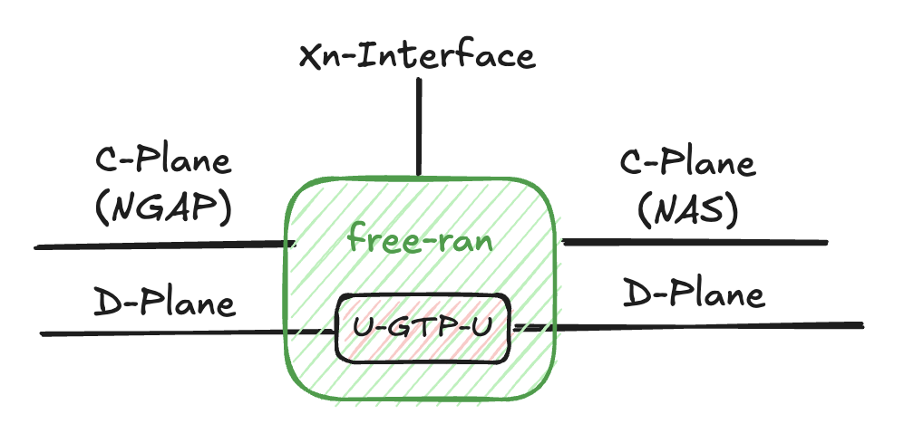

# gNB (RAN)

> [!Note]
> The gNB (gNodeB) is a 5G base station that handles message transfer between the core network and User Equipment (UE). It serves as the radio access network node in 5G networks.

## Architecture Overview



## Basic Connections

### Connections

The gNB (RAN) establishes four fundamental connections:

- **To Core Network:**

    - **Control Plane**: NGAP (Next Generation Application Protocol) with AMF (Access and Mobility Management Function)
    - **Data Plane**: GTP-U (GPRS Tunneling Protocol - User Plane) with UPF (User Plane Function)

- **To UE (User Equipment):**

    - **Control Plane**: NAS (Non-Access Stratum) signaling with UE
    - **Data Plane**: Raw packet transmission with UE over the radio interface

### Procedures

1. **NG Setup with AMF** (port: `38412`)

    - The gNB establishes a connection with the AMF to set up basic operational parameters and register itself with the core network.
    - This procedure includes exchanging supported features, served PLMNs (Public Land Mobile Networks), and TAC (Tracking Area Code) information.

2. **GTP Tunnel Establishment with UPF** (port: `2152`)

    - The gNB establishes GTP-U tunnels with the UPF for user data forwarding.
    - These tunnels are identified by TEID (Tunnel Endpoint Identifier) values for proper packet routing.

3. **UE Connection Management**

    Upon receiving a new UE control plane connection, the gNB initiates the following procedures:

    - **UE Registration**: Authenticates and registers the UE with the network
    - **PDU Session Establishment**: Creates data sessions for the UE's communication needs

## Xn Interface

In the current implementation, the Xn interface is specifically designed for exchanging TEID information to support the NR-DC (New Radio Dual Connectivity) feature.

Now, the Xn interface on each gNB listens on the address and port specified in the YAML configuration file, for example:

```yaml
xnIp: "10.0.1.2"
xnPort: 31415
```

This listener uses TCP, allowing any request to connect to it as needed. The processing function is defined in `gnb/xn.go` and can be extended in the `swtch` section.

The supported `NGAP` types are:

1. `ngapType.NGAPPDUPresentInitiatingMessage`

    1. `ngapType.ProcedureCodePDUSessionResourceSetup`: used for static NR-DC set up.
    2. `ngapType.ProcedureCodePDUSessionResourceModifyIndicatio`n: used for dynamic NR-DC initial set up.

2. `ngapType.NGAPPDUPresentSuccessfulOutcome`

    1. `ngapType.ProcedureCodePDUSessionResourceModifyIndication`: used for dynamic NR-DC final setup.

## UE types

- RanUe

    - Structure

        ```go
        type RanUe struct {
            amfUeNgapId int64
            ranUeNgapId int64

            mobileIdentity5GS nasType.MobileIdentity5GS

            ulTeid aper.OctetString
            dlTeid aper.OctetString

            n1Conn           net.Conn
            dataPlaneAddress *net.UDPAddr

            nrdcIndicator    bool
            nrdcIndicatorMtx sync.Mutex
        }
        ```

    - Function

        RanUE is used to record all infomation about the UE controlled be gNB.

- XnUE

    - Struct

        ```go
        type XnUe struct {
            imsi string

            ulTeid aper.OctetString
            dlTeid aper.OctetString

            dataPlaneAddress *net.UDPAddr
        }
        ```

    - Function

        XnUE is used to record the infomation about the UE offload from master gNB. XnUE will only handle **data plane** message for forwarding the packets between core network and UE.

## GTP Forwarding

The gNB implements GTP-U forwarding to handle user plane data between the UE and the core network. This includes:

- Encapsulation and decapsulation of user packets
- TEID-based routing

For more detailed information about GTP-U implementation, please refer to: [Userspace GTP-U](01-userspace-gtp-u.md)
