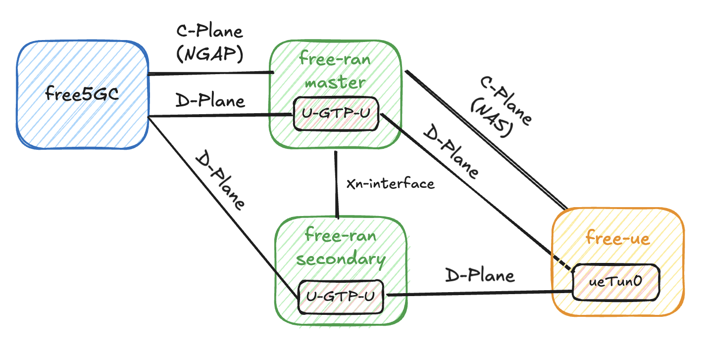

# Design Document

> [!Note]
> Here will give the details about implementations of free-ran-ue.

## General Design Architecture

### Basic Architecture

Both control plane and data plane connections exist among the core network, RAN, and UE.

### New Radio-Dual Connectivity Architecture

For dual connection, there will be addition data plane connections from core network to UE via RAN.

## Detail Documents

1. [Userspace GTP-U](01-userspace-gtp-u.md)
2. [gNB(RAN)](02-gnb.md)
3. [UE](03-ue.md)
4. [Static NR-DC](04-static-nr-dc.md)
5. [Dynamic NR-DC](05-dynamic-nr-dc.md)
