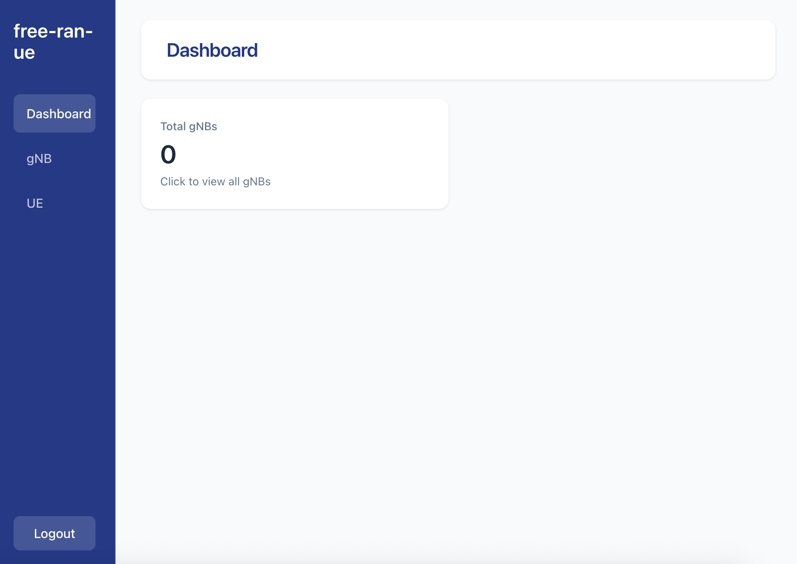
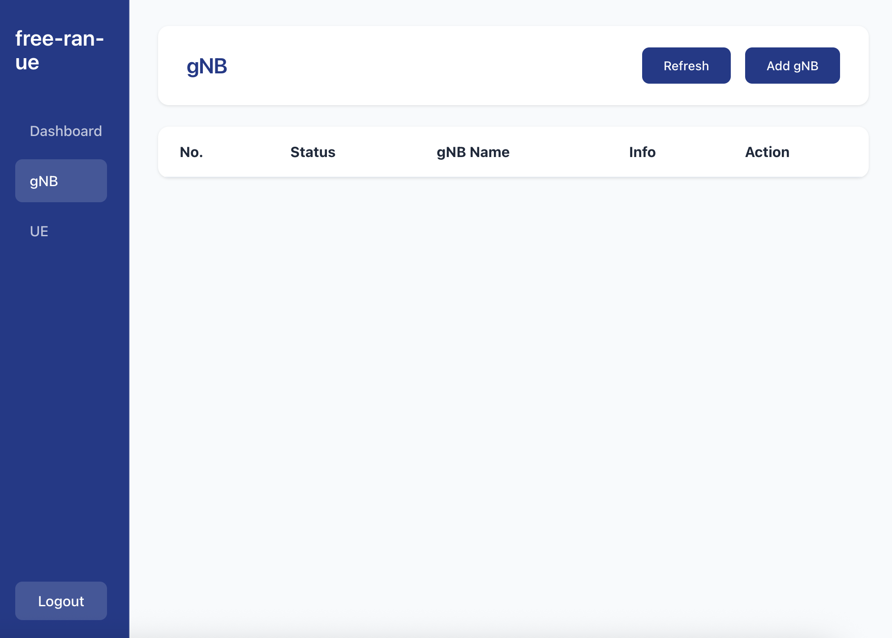
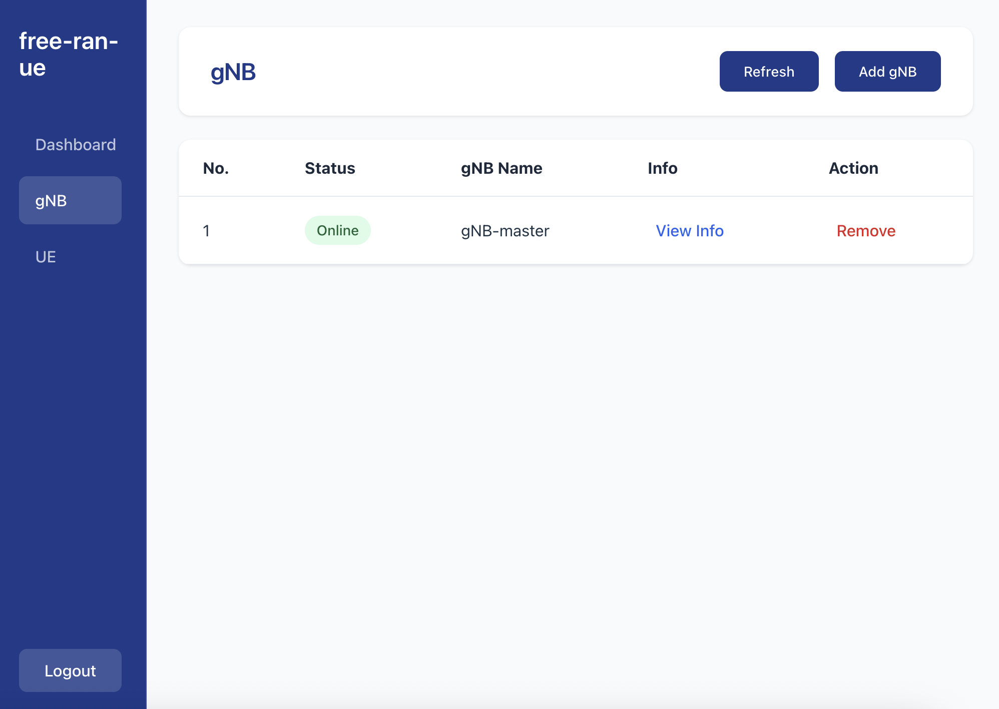

# Console

> [!Note]
> This is free-ran-ue management tool. The console will used to check the gNB and UE status and manually control UE's DC status.

## A. Prerequisites

- Golang:

    - free-ran-ue is built, tested and run with `go1.24.5 linux/amd64`
    - If Golang is not installed on your system, please execute the following commands:

        - Install Golang:

            ```bash
            wget https://dl.google.com/go/go1.24.5.linux-amd64.tar.gz
            sudo tar -C /usr/local -zxvf go1.24.5.linux-amd64.tar.gz
            mkdir -p ~/go/{bin,pkg,src}
            # The following assume that your shell is bash:
            echo 'export GOPATH=$HOME/go' >> ~/.bashrc
            echo 'export GOROOT=/usr/local/go' >> ~/.bashrc
            echo 'export PATH=$PATH:$GOPATH/bin:$GOROOT/bin' >> ~/.bashrc
            echo 'export GO111MODULE=auto' >> ~/.bashrc
            source ~/.bashrc
            ```

        - Check Installation. You should see the version information:

            ```bash
            go version
            ```

    - If another version of Golang is installed, please execute the following commands to replace it:

        ```bash
        sudo rm -rf /usr/local/go
        wget https://dl.google.com/go/go1.24.5.linux-amd64.tar.gz
        sudo tar -C /usr/local -zxvf go1.24.5.linux-amd64.tar.gz
        source $HOME/.bashrc
        go version
        ```

- Node.js

    - free-ran-ue's console is built, test and run with `node v20.19.2` / `yarn v1.22.22`.
    - If node and yarn is not installed on your system, olease execute the following commands:

        - Install node and yarn:

            ```bash
            curl -fsSL https://deb.nodesource.com/setup_20.x | sudo -E bash - 
            sudo apt update
            sudo apt install -y nodejs
            sudo corepack enable
            ```

        - Check Installation. You should see the version information:

            ```bash
            node -v
            yarn -v
            ```

## B. Clone and Build free-ran-ue

- Clone

    ```bash
    git clone https://github.com/free-ran-ue/free-ran-ue.git
    ```

- Build

    ```bash
    cd free-ran-ue
    make all
    ```

    After building, a binary executable file and frontend static files will be generated in the `build` folder.

## C. Start Console

- Modify the configuration file for console:

    The configuration `YAML` file template is located at `free-ran-ue/config/console.yaml`.

    The port field will be used for accessing the console page.

    Make sure the gNB's configuration YAML has the `api` section for console access, like:

    ```yaml
    api:
      ip: "10.0.1.2"
      port: 40104
    ```

- Start Console

    After configuring the `YAML` file, execute the binary in the `build` folder to start console with the specified configuration file:

    ```bash
    ./build/free-ran-ue console -c config/console.yaml
    ```

## D. Access Console

Start your browser, and access your host's ip with the port configure in the `YAML` file.

You will see the page like this:


Enter username and password:

- username: `admin`
- password: `free-ran-ue`

Then you will see the dashboard:



## E. Add gNB

Enter the gNB page:



Click the `Add gNB` button and enter the target gNB's API IP and port based the configuration file:


Add success:



## F. UE

At UE page, you can see the UE which is connected to gNB or be XnUE at secondary gNB.

- RAN UE List means there is basic UE connection via gNB:

    

- Xn UE List means there is DC UE connection at gNB:

    
