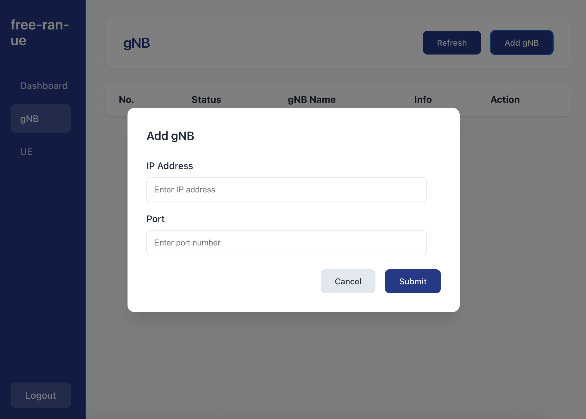
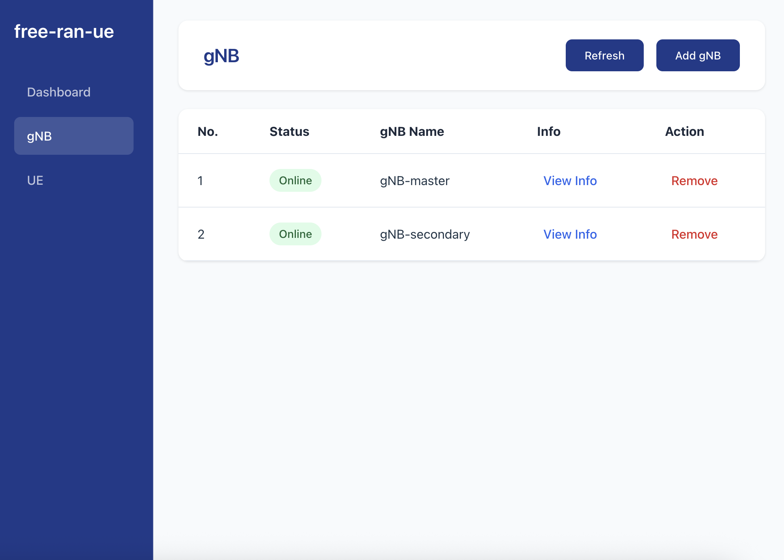
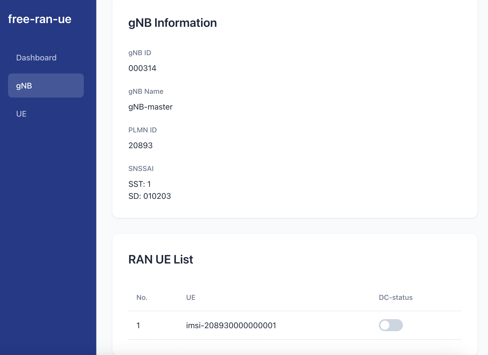
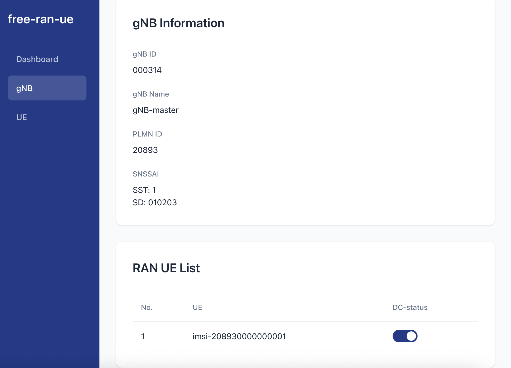
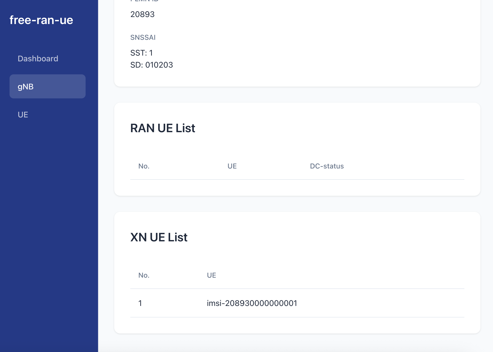

# Dynamic NR-DC with Namespace

> [!Note]
> Namespace provides an alternative to using a physical machine.
>
> With namespaces, you can simulate isolated network environments on a single machine, making it possible to run both free5GC and free-ran-ue without the need for multiple physical devices.
>
> For detailed namespace implementation, please refer to this implementation article: [Namespace-Based GTP5G Conflict Resolution for free5GC and PacketRusher](https://free5gc.org/blog/20250430/20250430/).

## Architecture Overview

Since the GTP port and the routing table will get in conflict, we can set up four namespaces for free5GC/Master RAN/Secondary RAN/UE, which means you don't need to bring up real machines.

Here is the deployment of these three namespaces:


## A. Prerequisites

- Golang / Node.js / Yarn

    ```bash
    wget https://dl.google.com/go/go1.24.5.linux-amd64.tar.gz
    sudo tar -C /usr/local -zxvf go1.24.5.linux-amd64.tar.gz
    mkdir -p ~/go/{bin,pkg,src}
    # The following assume that your shell is bash:
    echo 'export GOPATH=$HOME/go' >> ~/.bashrc
    echo 'export GOROOT=/usr/local/go' >> ~/.bashrc
    echo 'export PATH=$PATH:$GOPATH/bin:$GOROOT/bin' >> ~/.bashrc
    echo 'export GO111MODULE=auto' >> ~/.bashrc
    source ~/.bashrc

    curl -fsSL https://deb.nodesource.com/setup_20.x | sudo -E bash - 
    sudo apt update
    sudo apt install -y nodejs
    sudo corepack enable
    ```

- gtp5g

    ```bash
    sudo apt -y update
    sudo apt -y install git gcc g++ cmake autoconf libtool pkg-config libmnl-dev libyaml-dev
    git clone https://github.com/free5gc/gtp5g
    cd gtp5g
    make
    sudo make install
    ```

- MongoDB

    ```bash
    sudo apt install -y gnupg curl
    curl -fsSL https://www.mongodb.org/static/pgp/server-7.0.asc | \
    sudo gpg -o /usr/share/keyrings/mongodb-server-7.0.gpg --dearmor
    echo "deb [ arch=amd64,arm64 signed-by=/usr/share/keyrings/mongodb-server-7.0.gpg ] https://repo.mongodb.org/apt/ubuntu jammy/mongodb-org/7.0 multiverse" | sudo tee /etc/apt/sources.list.d/mongodb-org-7.0.list
    sudo apt update
    sudo apt install -y mongodb-org
    sudo systemctl enable mongod --now
    ```

## B. Namespace Setup

1. Clone and build free-ran-ue

    ```bash
    git clone https://github.com/free-ran-ue/free-ran-ue.git
    cd free-ran-ue
    make all
    ```

2. Bring up namespaces (under `free-ran-ue`)

    ```bash
    make dc-ns-u
    ```

    After using, there is `down` command to clean up the namespaces:

    ```bash
    make dc-ns-down
    ```

## C. Configure free5GC

1. Clone free5GC and build

    ```bash
    git clone -j `nproc` --recursive https://github.com/free5gc/free5gc
    cd free5gc
    make
    ```

2. Modify NF configuration:

    - ~/free5gc/config/amfcfg.yaml

        Replace `ngapIpList` IP from `127.0.0.18` to `10.0.1.1`:

        ```yaml
        ngapIpList:
          - 10.0.1.1
        ```

    - ~/free5gc/config/smfcfg.yaml

        Replace N3 interface's endpoints IP from `127.0.0.8` to your `10.0.1.1`:

        ```yaml
        interfaces:
          - interfaceType: N3
            endpoints:
              - 10.0.1.1
        ```

    - ~/free5gc/config/upfcfg.yaml

        Replace N6 interface address IP from `127.0.0.8` to `10.0.1.1`:

        ```yaml
        gtpu:
          forwarder: gtp5g
          iifList:
            - addr: 10.0.1.1
        ```

3. Check IP Forward is enabled

    If you have rebooted your machine, remember to run these command with setting your export network interface:

    ```bash
    sudo sysctl -w net.ipv4.ip_forward=1
    sudo iptables -t nat -A POSTROUTING -o <export network interface> -j MASQUERADE
    sudo systemctl stop ufw
    sudo iptables -I FORWARD 1 -j ACCEPT
    ```

4. Run free5GC (under `free5gc`)

    ```bash
    ./run.sh
    ```

5. Run webconsole and create a subscriber by default (under `free5gc`)

    ```bash
    cd webconsole
    ./run.sh
    ```

    For creating a subscriber, please refer to: [Create Subscriber via Webconsole](https://free5gc.org/guide/Webconsole/Create-Subscriber-via-webconsole/)

    Make sure there is a flow rule (e.g. `1.1.1.1/32`) under the network slice.

## D. Start gNBs

The configuration file `config/gnb.yaml` has already been set up with the environment values. No need to modify the configuration.

- Master-gNB

    1. Enter the Master-RAN namespace (under `free-ran-ue`)

        ```bash
        make dc-ns-mran
        ```

    2. Start Master-gNB

        ```bash
        ./build/free-ran-ue gnb -c config/gnb-dc-dynamic-master.yaml
        ```

- Secondary-gNB

    1. Enter the Master-RAN namespace (under `free-ran-ue`)

        ```bash
        make dc-ns-sran
        ```

    2. Start Master-gNB

        ```bash
        ./build/free-ran-ue gnb -c config/gnb-dc-dynamic-secondary.yaml
        ```

## E. Start UE

The configuration file `config/ue-dc-dynamic.yaml` has already been set up with the environment values. No need to modify the configuration.

1. Enter the UE-namespace (under `free-ran-ue`)

    ```bash
    make dc-ns-ue
    ```

2. Start UE

    ```bash
    ./build/free-ran-ue ue -c config/ue-dc-dynamic.yaml
    ```

## F. Start Console

1. Run in the host namespace
2. Start Console

    ```bash
    ./build/free-ran-ue console -c config/console.yaml
    ```

3. Add gNB

    - Sign in the console:

        - username: `admin`
        - password: `free-ran-ue`

        

    - Add gNB-master and gNB-secondary:

        - gNB-master

            - IP Address: `10.0.1.2`
            - Port: `40104`

        - gNB-secondary

            - IP Address: `10.0.1.3`
            - Port: `40104`

        

    - Check add success:

        

## G. ICMP Test

1. Enter the UE-namespace (under `free-ran-ue`)

    ```bash
    make dc-ns-ue
    ```

2. Check the `ueTun0` interface

    ```bash
    ifconfig
    ```

    Expected output included:

    ```bash
    ueTun0: flags=4305<UP,POINTOPOINT,RUNNING,NOARP,MULTICAST>  mtu 1500
            inet 10.60.0.1  netmask 255.255.255.255  destination 10.60.0.1
            inet6 fe80::b1e9:2933:3c64:b981  prefixlen 64  scopeid 0x20<link>
            unspec 00-00-00-00-00-00-00-00-00-00-00-00-00-00-00-00  txqueuelen 500  (UNSPEC)
            RX packets 0  bytes 0 (0.0 B)
            RX errors 0  dropped 0  overruns 0  frame 0
            TX packets 3  bytes 144 (144.0 B)
            TX errors 0  dropped 0 overruns 0  carrier 0  collisions 0
    ```

3. Before DC enabled:

    ICMP test with `ueTun0` via Master-gNB:

    ```bash
    ping -I ueTun0 8.8.8.8 -c 5
    ```

    Expected successful output:

    ```bash
    PING 8.8.8.8 (8.8.8.8) from 10.60.0.2 ueTun0: 56(84) bytes of data.
    64 bytes from 8.8.8.8: icmp_seq=1 ttl=116 time=3.71 ms
    64 bytes from 8.8.8.8: icmp_seq=2 ttl=116 time=4.08 ms
    64 bytes from 8.8.8.8: icmp_seq=3 ttl=116 time=3.82 ms
    64 bytes from 8.8.8.8: icmp_seq=4 ttl=116 time=4.25 ms
    64 bytes from 8.8.8.8: icmp_seq=5 ttl=116 time=3.77 ms

    --- 8.8.8.8 ping statistics ---
    5 packets transmitted, 5 received, 0% packet loss, time 4006ms
    rtt min/avg/max/mdev = 3.706/3.926/4.252/0.206 ms
    ```

    ICMP test with `ueTun0` via Secondary-gNB:

    ```bash
    ping -I ueTun0 1.1.1.1 -c 5
    ```

    Expected successful output:

    ```bash
    PING 1.1.1.1 (1.1.1.1) from 10.60.0.2 ueTun0: 56(84) bytes of data.
    64 bytes from 1.1.1.1: icmp_seq=1 ttl=49 time=4.51 ms
    64 bytes from 1.1.1.1: icmp_seq=2 ttl=49 time=4.46 ms
    64 bytes from 1.1.1.1: icmp_seq=3 ttl=49 time=4.27 ms
    64 bytes from 1.1.1.1: icmp_seq=4 ttl=49 time=3.97 ms
    64 bytes from 1.1.1.1: icmp_seq=5 ttl=49 time=4.64 ms

    --- 1.1.1.1 ping statistics ---
    5 packets transmitted, 5 received, 0% packet loss, time 4007ms
    rtt min/avg/max/mdev = 3.972/4.371/4.644/0.232 ms
    ```

4. Use console to start DC:

    1. Enter gNB-master's information page:

        

    2. Turn on the DC of UE:

        

    3. Check XnUE exist in gNB-secondary:

        

5. After DC enabled:

    ICMP test with `ueTun0` via Master-gNB:

    ```bash
    ping -I ueTun0 8.8.8.8 -c 5
    ```

    Expected successful output:

    ```bash
    PING 8.8.8.8 (8.8.8.8) from 10.60.0.2 ueTun0: 56(84) bytes of data.
    64 bytes from 8.8.8.8: icmp_seq=1 ttl=116 time=4.12 ms
    64 bytes from 8.8.8.8: icmp_seq=2 ttl=116 time=4.11 ms
    64 bytes from 8.8.8.8: icmp_seq=3 ttl=116 time=3.99 ms
    64 bytes from 8.8.8.8: icmp_seq=4 ttl=116 time=3.68 ms
    64 bytes from 8.8.8.8: icmp_seq=5 ttl=116 time=3.63 ms

    --- 8.8.8.8 ping statistics ---
    5 packets transmitted, 5 received, 0% packet loss, time 4007ms
    rtt min/avg/max/mdev = 3.627/3.905/4.120/0.212 ms
    ```

    ICMP test with `ueTun0` via Secondary-gNB:

    ```bash
    ping -I ueTun0 1.1.1.1 -c 5
    ```

    Expected successful output:

    ```bash
    PING 1.1.1.1 (1.1.1.1) from 10.60.0.2 ueTun0: 56(84) bytes of data.
    64 bytes from 1.1.1.1: icmp_seq=1 ttl=49 time=4.80 ms
    64 bytes from 1.1.1.1: icmp_seq=2 ttl=49 time=4.43 ms
    64 bytes from 1.1.1.1: icmp_seq=3 ttl=49 time=4.42 ms
    64 bytes from 1.1.1.1: icmp_seq=4 ttl=49 time=4.21 ms
    64 bytes from 1.1.1.1: icmp_seq=5 ttl=49 time=4.78 ms

    --- 1.1.1.1 ping statistics ---
    5 packets transmitted, 5 received, 0% packet loss, time 4006ms
    rtt min/avg/max/mdev = 4.210/4.527/4.797/0.225 ms
    ```
