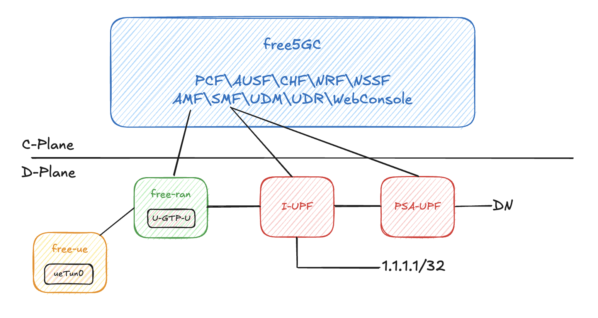

# Docker ULCL Deployment

> [!Note]
> ULCL provides an Uplink Classifier for splitting the traffic of specific DN.

## Architecture Overview

In ULCL, we define a specific traffic route for the destination `1.1.1.1/32`. All traffic destined for `1.1.1.1/32` will be routed through the path `gNB - I-UPF - DN`. Other traffic will be routed through `gNB - I-UPF - PSA-UPF - DN`.

Here is the deployment of ULCL version:



## A. Prerequisites

- Docker:

    - Install

        ```bash
        sudo apt update
        sudo apt install apt-transport-https ca-certificates curl software-properties-common
        curl -fsSL https://download.docker.com/linux/ubuntu/gpg | sudo apt-key add -
        sudo add-apt-repository "deb [arch=amd64] https://download.docker.com/linux/ubuntu $(lsb_release -cs) stable"
        sudo apt update
        sudo apt install docker-ce
        sudo systemctl start docker
        sudo docker --version
        ```

    - Docker group (avoid sudo problem)

        ```bash
        sudo groupadd docker
        sudo usermod -aG docker $USER
        newgrp docker
        ```

- gtp5g

    - Packages

        ```bash
        sudo apt -y update
        sudo apt -y install git gcc g++ cmake autoconf libtool pkg-config libmnl-dev libyaml-dev
        ```

    - Clone, Build and Install

        ```bash
        git clone https://github.com/free5gc/gtp5g
        cd gtp5g
        make
        sudo make install
        ```

## B. Build free-ran-ue Image

- Clone

    ```bash
    git clone https://github.com/free-ran-ue/free-ran-ue.git
    ```

- Build Image

    ```bash
    cd free-ran-ue
    make docker
    ```

    After building, use `docker images` cli to check image.

## C. Start ULCL Compose

```bash
docker compose -f docker/docker-compose-ulcl.yaml up
```

For the specific ue routes, please configure at `free-ran-ue/docker/config/ULCL/uerouting.yaml`.

In default, there is a specific path for destination `1.1.1.1/32`.

## D. UE

After docker compose started, UE can be started by entering the `ue` container.

1. Enter `ue` container

    ```bash
    docker exec -it ue bash
    ```

2. Start UE

    ```bash
    ./free-ran-ue ue -c uecfg.yaml
    ```

3. Check Network Interface

    ```bash
    ifconfig
    ```

    Expected output included:

    ```bash
    ueTun0: flags=4305<UP,POINTOPOINT,RUNNING,NOARP,MULTICAST>  mtu 1500
        inet 10.60.0.1  netmask 255.255.255.255  destination 10.60.0.1
        inet6 fe80::b1e9:2933:3c64:b981  prefixlen 64  scopeid 0x20<link>
        unspec 00-00-00-00-00-00-00-00-00-00-00-00-00-00-00-00  txqueuelen 500  (UNSPEC)
        RX packets 0  bytes 0 (0.0 B)
        RX errors 0  dropped 0  overruns 0  frame 0
        TX packets 0  bytes 0 (0.0 B)
        TX errors 0  dropped 0 overruns 0  carrier 0  collisions 0
    ```

4. Application

    Now, the whole deployment is finished. Network interface `ueTun0` can be used for any application, e.g. ICMP / iperf.
